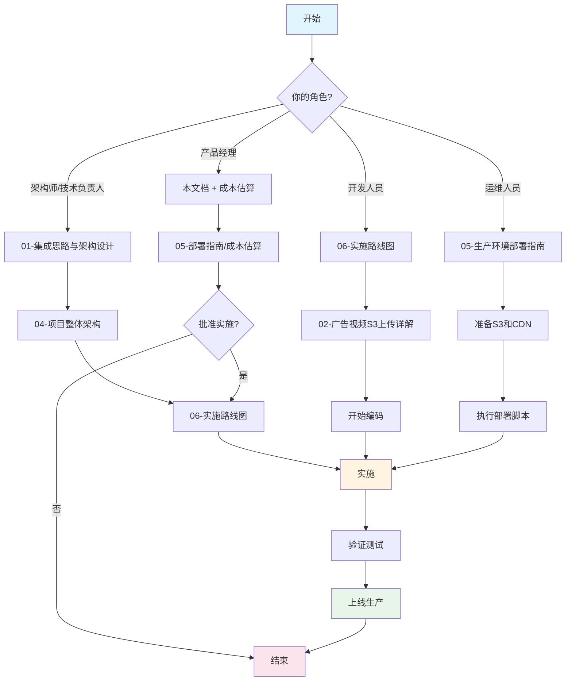

# 📖 S3集成指南总览（必读）

## 🎯 核心结论（30秒速读）

**当前状态**: 项目已完成**90%的S3支持**，架构设计完美✅

**唯一差距**: MCP广告服务器硬编码了本地路径，需要2-3小时修改

**修改难度**: 🟢 **简单** - 只需修改1个文件约50行代码

**投资回报**: 🚀 **极高** - 4小时工作量，换来无限容量+全球CDN加速

---

## 📊 项目S3支持现状

### 已完成组件（90%）

```
┌─────────────────────────────────────────────────────────┐
│  ✅ 存储抽象层 (src/ai_chat/storage/)           100%   │
│  ├─ storage_interface.py   - 统一接口定义             │
│  ├─ local_service.py       - 本地存储实现（完整）     │
│  ├─ s3_service.py          - S3存储实现（完整）       │
│  └─ storage_factory.py     - 工厂模式自动选择         │
│                                                         │
│  特性:                                                  │
│  ✅ 支持上传、列表、删除、URL生成                      │
│  ✅ CLIENT_ID多租户隔离                                │
│  ✅ CDN URL支持                                        │
│  ✅ 环境变量配置                                        │
│  ✅ boto3可选依赖                                      │
└─────────────────────────────────────────────────────────┘

┌─────────────────────────────────────────────────────────┐
│  ✅ 配置系统 (src/ai_chat/config_manager/system.py) 100%│
│  ├─ storage_type: "local" | "s3"                       │
│  ├─ s3_bucket / s3_region / s3_access_key              │
│  ├─ cdn_url 配置                                        │
│  └─ get_resource_url() 方法                            │
└─────────────────────────────────────────────────────────┘

┌─────────────────────────────────────────────────────────┐
│  ✅ API Routes (src/ai_chat/routes.py)            100%  │
│  ├─ POST /api/upload        - 使用storage_factory     │
│  ├─ GET  /api/media/list    - 使用storage_factory     │
│  ├─ DELETE /api/media/delete - 使用storage_factory    │
│  └─ 所有API都支持CLIENT_ID和S3                         │
└─────────────────────────────────────────────────────────┘

┌─────────────────────────────────────────────────────────┐
│  ✅ Web控制面板 (web_tool/control-panel.html)   100%   │
│  ├─ 广告上传（支持CLIENT_ID参数）                       │
│  ├─ 文件列表（支持CLIENT_ID过滤）                       │
│  ├─ 文件删除（支持CLIENT_ID验证）                       │
│  └─ 完全支持本地和S3模式                               │
└─────────────────────────────────────────────────────────┘
```

### 待完成组件（10%）

```
┌─────────────────────────────────────────────────────────┐
│  ❌ MCP广告服务器 (src/ai_chat/mcpp/advertisement_server.py)│
│                                                    20%   │
│  问题:                                                   │
│  ❌ 硬编码: self.ads_dir = Path("ads") / client_id      │
│  ❌ 只扫描本地: for file in self.ads_dir.iterdir()      │
│  ❌ 只生成本地URL: f"/ads/{client_id}/{filename}"       │
│                                                         │
│  需要修改:                                               │
│  ✅ 注入storage_service依赖                             │
│  ✅ 使用await storage_service.list_files("ads")        │
│  ✅ 使用storage_service.get_file_url()生成CDN URL      │
│                                                         │
│  工作量: 2-3小时                                         │
│  影响: 🔴 关键 - 完成后S3即可生产使用                    │
└─────────────────────────────────────────────────────────┘
```

---

## 🗺️ 文档地图

### 学习路径



---

## 📚 文档系列概览

### 📄 01-集成思路与架构设计
**页数**: 约150行  
**阅读时间**: 10分钟  
**难度**: ⭐⭐⭐⭐

**核心内容**:
- 存储抽象层三层架构
- 本地/S3无缝切换原理
- CLIENT_ID多租户隔离机制
- 工厂模式实现
- 存储切换流程图

**适合人群**: 架构师、高级开发

**关键图表**:
- ✅ 存储抽象层架构图
- ✅ 本地/S3切换流程图
- ✅ CLIENT_ID隔离示意图

---

### 📄 02-广告视频S3上传详解
**页数**: 约300行  
**阅读时间**: 15分钟  
**难度**: ⭐⭐⭐

**核心内容**:
- 上传完整序列图
- API代码逐行详解
- Web控制面板JavaScript
- WebSocket刷新机制
- S3存储结构

**适合人群**: 开发人员

**关键代码**:
- ✅ `upload_media()` API实现
- ✅ `uploadMediaFiles()` 前端实现
- ✅ WebSocket广播代码

---

### 📄 03-Agent资源动态上传
**页数**: 约250行  
**阅读时间**: 12分钟  
**难度**: ⭐⭐⭐⭐

**核心内容**:
- Agent对话中动态上传图片/视频
- MCP工具设计（upload_image/upload_video）
- 前端消息解析
- 使用场景示例

**适合人群**: 高级开发（未来功能）

**状态**: 📝 设计文档，未实施

---

### 📄 04-项目整体架构与部署
**页数**: 约400行  
**阅读时间**: 20分钟  
**难度**: ⭐⭐⭐⭐⭐

**核心内容**:
- 完整系统架构图
- 核心组件详解（Service Context等）
- 启动流程序列图
- 数据流向图
- 设计模式应用
- 性能优化设计

**适合人群**: 架构师、所有开发人员

**关键图表**:
- ✅ 系统架构总览图
- ✅ 启动流程序列图
- ✅ 数据流向图
- ✅ MCP通信流程图
- ✅ 分层架构图

**🌟 强烈推荐阅读**

---

### 📄 05-生产环境部署指南
**页数**: 约450行  
**阅读时间**: 25分钟  
**难度**: ⭐⭐⭐

**核心内容**:
- S3桶创建步骤
- IAM用户配置
- CDN配置详解
- Docker多容器部署
- Caddy反向代理
- 成本估算（AWS/阿里云/B2）
- 监控和维护

**适合人群**: 运维人员、部署工程师

**实用工具**:
- ✅ docker-compose.yml完整示例
- ✅ Caddyfile配置示例
- ✅ 部署脚本
- ✅ 健康检查命令

---

### 📄 06-实施路线图
**页数**: 约300行  
**阅读时间**: 15分钟  
**难度**: ⭐⭐

**核心内容**:
- 当前进度评估（90%）
- 待完成任务清单
- 分阶段实施计划
- 优先级矩阵（P0-P3）
- 时间线规划
- 检查清单

**适合人群**: 项目经理、开发人员

**实用工具**:
- ✅ 任务清单
- ✅ 时间估算
- ✅ 优先级矩阵

**🌟 项目管理必读**

---

### 📄 07-常见问题FAQ
**页数**: 约350行  
**阅读时间**: 按需查阅  
**难度**: ⭐⭐

**核心内容**:
- 25+个常见问题
- 配置问题（Q1-Q4）
- 安全问题（Q5-Q6）
- 部署问题（Q7-Q9）
- 性能问题（Q10-Q12）
- 故障排除（Q13-Q15）
- 成本问题（Q16-Q17）
- 迁移问题（Q18-Q19）

**适合人群**: 所有人

**使用方式**: 遇到问题时快速查找

---

## 🎯 核心架构图（精华）

### 存储抽象层架构

```
业务层 (不关心存储实现)
  ├─ API Routes
  ├─ MCP Servers  
  └─ WebSocket Handler
         ↓ 调用统一接口
存储抽象层 (Storage Factory)
         ↓ 根据配置选择
    ┌────┴────┐
    ↓         ↓
本地存储    S3存储
 (开发)    (生产)
```

### CLIENT_ID隔离机制

```
本地模式:
ads/
├─ client_001/  ← 目录隔离
├─ client_002/
└─ client_003/

S3模式:
s3://bucket/
├─ client_001/  ← Key前缀隔离
├─ client_002/
└─ client_003/

✅ 两种模式使用相同的隔离逻辑
```

### 部署架构（生产环境）

```
用户手机 → Web控制面板 → 上传视频
                ↓
          FastAPI Backend
                ↓
          Storage Factory
         ↙            ↘
    本地存储        S3存储
    (开发)       (生产)
                     ↓
                 AWS S3/阿里云OSS
                     ↓
                    CDN
                     ↓
          树莓派前端播放
```

---

## 🚀 最小可行方案（MVP）

### 4小时完成S3集成

**任务清单**:
```
[ ] 修改 advertisement_server.py        2小时
    ├─ 注入storage_service依赖          30分钟
    ├─ 修改_scan_advertisements         1小时
    └─ 修改get_advertisement_playlist   30分钟

[ ] 测试本地模式兼容性                  30分钟
    └─ 确保本地模式仍能正常工作

[ ] 测试S3模式功能                      1小时
    ├─ 配置S3凭证                       15分钟
    ├─ 上传测试文件                     15分钟
    └─ 验证MCP能从S3加载                30分钟

[ ] 创建配置示例                        30分钟
    ├─ conf.s3.example.yaml
    └─ .env.s3.example

✅ 总计: 4小时
✅ 结果: S3完全可用
```

---

## 💡 关键概念理解

### 概念1: 存储抽象

**问**: 什么是存储抽象层？

**答**: 就像电源插座一样，你不关心是火电还是水电，只管插上充电。

```
业务代码:
  storage.upload_file(data, "ads", "video.mp4")
  
  ↓ 插座接口（StorageInterface）
  
底层实现:
  本地存储: 写入文件系统
  S3存储: 调用boto3上传
  
✅ 业务代码完全相同，底层自动切换
```

---

### 概念2: CLIENT_ID隔离

**问**: CLIENT_ID如何确保数据隔离？

**答**: 就像公寓楼一样，每个租户有独立的房间号。

```
S3桶 = 公寓楼
CLIENT_ID = 房间号

client_001 (星巴克) = 101室
  └─ 只能访问 s3://bucket/client_001/*

client_002 (麦当劳) = 102室
  └─ 只能访问 s3://bucket/client_002/*

✅ 房间号不同，永不串门
```

---

### 概念3: 工厂模式

**问**: 工厂模式如何工作？

**答**: 就像订外卖一样，你说"要咖啡"，平台自动分配最近的咖啡店。

```
你: "我要存储服务"（调用create_storage_service）
工厂: "好的，看看你的配置..."
  ↓ 读取 storage_type
  ↓ 如果是 "local" → 分配本地存储
  ↓ 如果是 "s3" → 分配S3存储
  ↓ 返回: storage_service

你: 开始使用（不关心是本地还是S3）

✅ 配置决定实现，调用方无感知
```

---

## 📈 实施优先级

### 🔴 P0 - 立即实施（本周必须）

**MCP广告服务器S3支持**
- **工作量**: 2-3小时
- **影响**: 🔴 关键 - 完成后S3即可生产使用
- **难度**: 🟢 简单 - 只修改1个文件
- **文档**: [06-实施路线图 → 阶段1](./06-实施路线图.md#阶段1-mcp广告服务器s3支持核心)

---

### 🟡 P1 - 短期实施（本月完成）

**配置和部署脚本**
- **工作量**: 1-2小时
- **影响**: 🟡 重要 - 提升部署效率
- **难度**: 🟢 简单
- **文档**: [06-实施路线图 → 阶段3](./06-实施路线图.md#阶段3-配置和文档完善)

---

### 🟢 P2 - 中期实施（可选）

**静态文件S3代理**
- **工作量**: 1小时
- **影响**: 🟢 可选 - 如果使用CDN直链可跳过
- **难度**: 🟢 简单
- **文档**: [06-实施路线图 → 阶段2](./06-实施路线图.md#阶段2-静态文件服务s3代理可选)

---

### 🔵 P3 - 长期规划（未来考虑）

**Agent资源动态上传**
- **工作量**: 4-6小时
- **影响**: 🔵 增强 - 未来功能
- **难度**: ⭐⭐⭐⭐
- **文档**: [03-Agent资源动态上传](./03-Agent资源动态上传.md)

---

## 💰 成本快速参考

### 小规模（100GB存储 + 200GB流量/月）

| 服务商 | 月度成本 | 推荐场景 |
|--------|---------|---------|
| **Backblaze B2 + Cloudflare** | ~$5 | 🥇 最省钱 |
| **阿里云OSS + CDN** | ~$30 | 国内用户 |
| **AWS S3 + CloudFront** | ~$50 | 国际用户 |
| **本地存储** | $0 | 开发测试 |

**推荐**: 
- 开发环境 → 本地存储（免费）
- 生产环境 → Backblaze B2（最省钱）

详细成本估算请查看：[05-生产环境部署指南 → 成本估算](./05-生产环境部署指南.md#-成本估算)

---

## 🎯 立即行动指南

### 如果你有4小时

```bash
# 1. 修改MCP广告服务器 (2小时)
vim src/ai_chat/mcpp/advertisement_server.py
# 参考: 06-实施路线图.md 阶段1

# 2. 测试本地模式 (30分钟)
pytest tests/test_advertisement_server.py

# 3. 测试S3模式 (1小时)
export STORAGE_TYPE=s3
export S3_BUCKET=test-bucket
python run_server.py

# 4. 创建配置示例 (30分钟)
cp conf.yaml conf.s3.example.yaml
# 编辑S3参数

✅ 完成！S3可用
```

### 如果你只有30分钟

```bash
# 快速了解
阅读: 本文档 (10分钟)
阅读: 06-实施路线图.md (10分钟)
阅读: 04-项目整体架构.md 前半部分 (10分钟)

✅ 了解: 项目状态、实施难度、架构设计
```

---

## 📊 关键指标

### 代码修改范围

```
需要修改的文件: 1个
需要新增的文件: 2个（配置示例）
需要修改的代码行: ~50行
需要新增的代码行: ~30行

总工作量: 2-3小时编码 + 1小时测试 = 4小时
```

### 功能覆盖率

```
上传功能:  ████████████████████ 100% ✅
列表功能:  ████████████████████ 100% ✅
删除功能:  ████████████████████ 100% ✅
播放功能:  ████░░░░░░░░░░░░░░░░  20% ❌ (MCP待修改)
刷新功能:  ████░░░░░░░░░░░░░░░░  20% ❌ (MCP待修改)

完成MCP修改后:
播放功能:  ████████████████████ 100% ✅
刷新功能:  ████████████████████ 100% ✅

总覆盖率: 90% → 100%
```

---

## 🎯 成功标准

### MVP成功标准

完成以下测试即为成功：

```bash
# ✅ 测试1: 上传到S3
curl -F "file=@test.mp4" \
     -F "client=client_001" \
     -F "category=ads" \
     http://localhost:12393/api/upload

# 预期结果:
# {
#   "success": true,
#   "url": "https://cdn.example.com/client_001/ads/test_1730000000.mp4"
# }

# ✅ 测试2: 从S3列出文件
curl http://localhost:12393/api/media/list?category=ads&client=client_001

# 预期结果:
# {
#   "files": [
#     {"filename": "test_1730000000.mp4", "url": "https://cdn.example.com/..."}
#   ]
# }

# ✅ 测试3: MCP获取播放列表
# 前端调用 get_advertisement_playlist MCP工具

# 预期结果:
# {
#   "playlist": [
#     {"filename": "test_1730000000.mp4", "url": "https://cdn.example.com/..."}
#   ]
# }

# ✅ 测试4: 前端播放CDN视频
# 打开前端，应该能看到MCP面板显示视频
# 视频URL应该是CDN地址，能正常播放

# ✅ 测试5: 删除S3文件
curl -X DELETE \
     "http://localhost:12393/api/media/delete?category=ads&filename=test_1730000000.mp4&client=client_001"

# 预期结果:
# { "success": true }

# 验证S3文件已删除
aws s3 ls s3://my-bucket/client_001/ads/
# 应该不再显示该文件
```

---

## 🎉 完成后的收益

### 技术收益

- ✅ **无限容量** - 不再担心磁盘满
- ✅ **高可用** - 99.999999999%可靠性
- ✅ **全球CDN** - 任何地方快速访问
- ✅ **自动备份** - 数据永不丢失
- ✅ **易于扩容** - 新增客户只需配置CLIENT_ID
- ✅ **统一管理** - 所有客户共享一个S3桶

### 业务收益

- 📱 **移动上传** - 店长手机直接上传
- 🌍 **多地部署** - 支持全球多个广告屏
- 💰 **成本可控** - 按实际使用量付费
- 🚀 **快速迭代** - Web控制面板实时更新
- 🔒 **数据安全** - CLIENT_ID完全隔离
- ⚡ **实时生效** - 上传后WebSocket自动刷新

---

## 📞 快速帮助

### 我该读哪个文档？

| 你的问题 | 推荐文档 | 章节 |
|---------|---------|------|
| **如何切换到S3？** | FAQ | Q2 |
| **S3凭证怎么配置？** | FAQ | Q3 |
| **需要修改哪些代码？** | 实施路线图 | 阶段1 |
| **如何部署到生产？** | 生产部署指南 | 步骤1-6 |
| **成本多少钱？** | FAQ | Q17 或 生产部署指南 |
| **如何确保数据隔离？** | FAQ | Q5 或 集成思路 |
| **MCP如何集成S3？** | 实施路线图 | 阶段1 |
| **前端如何播放CDN视频？** | 广告视频上传 | 播放流程 |

---

## 🎯 核心理念

> **"一次设计，永久受益"**

本项目的存储抽象层设计，使得：
- ✅ 开发时使用本地存储（快速迭代）
- ✅ 生产时切换S3存储（无限容量）
- ✅ 未来支持MinIO（自建方案）
- ✅ 未来支持OSS（阿里云）
- ✅ **无需修改业务代码**

> **"配置即命令"**

通过修改一行配置，即可改变整个系统的存储方式：
```yaml
storage_type: "local"  → storage_type: "s3"
```

> **"多租户天然隔离"**

CLIENT_ID设计确保：
- ✅ 星巴克看不到麦当劳的广告
- ✅ 每个客户独立管理
- ✅ 数据完全隔离
- ✅ 计费独立核算

---

## 📚 推荐阅读顺序

### 第一次阅读（快速了解）
```
1. 本文档 (00-总览-必读.md)           10分钟
2. 实施路线图 (06)                    15分钟
3. 项目整体架构 (04) - 前半部分        10分钟

✅ 总计: 35分钟
✅ 了解: 项目状态、实施难度、架构概览
```

### 第二次阅读（深入理解）
```
1. 集成思路与架构设计 (01)            15分钟
2. 项目整体架构 (04) - 完整            20分钟
3. 广告视频S3上传详解 (02)            15分钟

✅ 总计: 50分钟
✅ 理解: 设计理念、完整架构、上传流程
```

### 第三次阅读（准备实施）
```
1. 实施路线图 (06) - 详细任务          20分钟
2. 生产环境部署指南 (05)               25分钟
3. 常见问题FAQ (07) - 相关问题         15分钟

✅ 总计: 60分钟
✅ 准备: 开始编码或部署
```

---

## 🎉 总结

### 项目亮点

1. **架构先进** - 存储抽象层设计完美
2. **90%完成** - 基础设施已就绪
3. **易于实施** - 4小时完成核心功能
4. **成本可控** - 月度$5-50
5. **多租户** - CLIENT_ID天然隔离
6. **文档完整** - 7篇详细文档

### 立即行动

**👉 下一步**: 阅读 [06-实施路线图](./06-实施路线图.md)，开始4小时MVP实施！

---

**文档系列**: S3集成完整指南  
**创建日期**: 2024-10-27  
**文档数量**: 8篇  
**总字数**: ~5000行  
**预计阅读时间**: 2小时（完整）/ 30分钟（快速）

---

🎯 **目标**: 让任何开发者都能轻松理解和实施S3集成！

