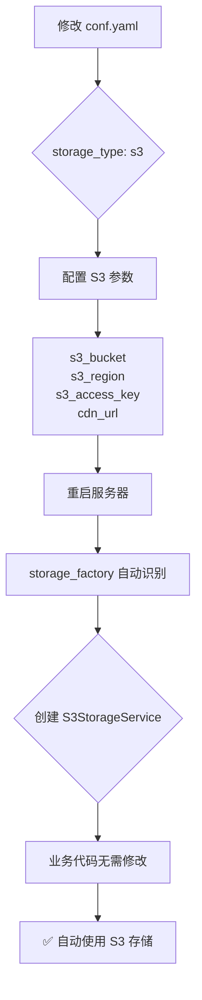
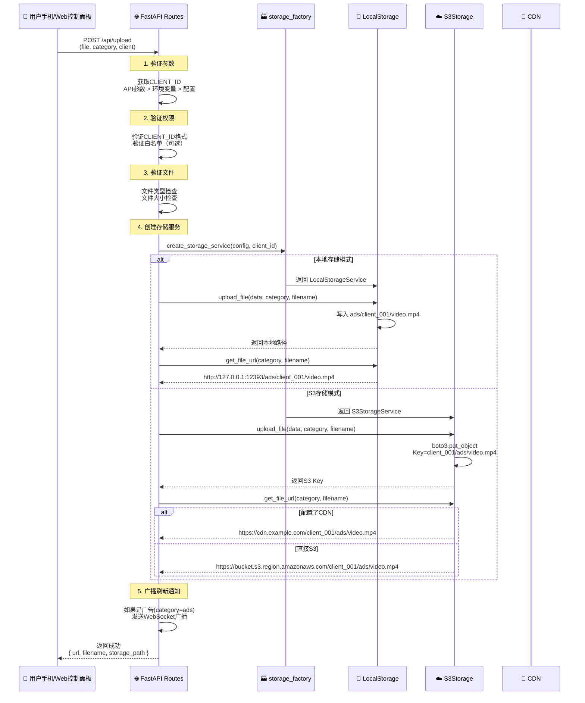
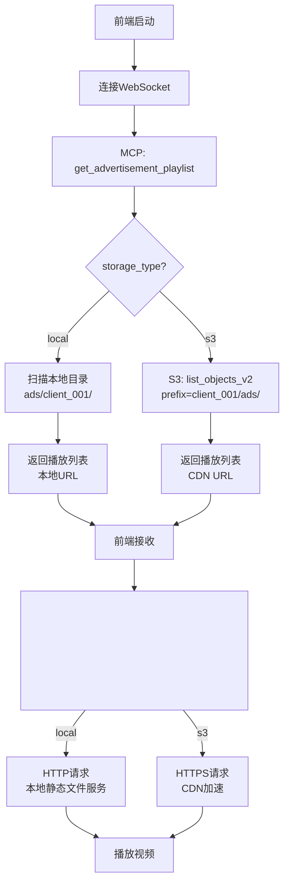

# 📦 S3集成思路与架构设计

## 🎯 核心设计理念

### 设计原则
本项目采用**存储抽象层**设计模式，实现了**本地存储**和**云存储（S3）**的无缝切换。核心思想是：

1. **统一接口** - 无论底层是本地文件系统还是S3，上层代码使用相同的API
2. **配置驱动** - 通过配置文件`conf.yaml`一键切换存储方式
3. **多租户隔离** - 每个客户（CLIENT_ID）的数据完全隔离，互不干扰
4. **零代码修改** - 从本地切换到S3，不需要修改业务逻辑代码

---

## 🏗️ 存储抽象层架构

### 三层架构设计

```
┌─────────────────────────────────────────────────────────────┐
│                     业务层 (Business Layer)                   │
│  routes.py, MCP Server, WebSocket Handler, etc.             │
│  ✅ 不关心底层存储实现                                        │
│  ✅ 只调用统一的 storage_service 接口                        │
└────────────────────┬────────────────────────────────────────┘
                     │
                     │ 调用统一接口
                     ↓
┌─────────────────────────────────────────────────────────────┐
│              存储抽象层 (Storage Abstraction Layer)           │
│                                                              │
│  ┌─────────────────────────────────────────────────────┐   │
│  │  StorageInterface (接口定义)                         │   │
│  │  ├─ upload_file(file_data, category, filename)      │   │
│  │  ├─ list_files(category)                            │   │
│  │  ├─ delete_file(category, filename)                 │   │
│  │  ├─ file_exists(category, filename)                 │   │
│  │  └─ get_file_url(category, filename)                │   │
│  └─────────────────────────────────────────────────────┘   │
│                                                              │
│  ┌─────────────────────────────────────────────────────┐   │
│  │  storage_factory.py (工厂模式)                       │   │
│  │  根据配置自动创建对应的存储服务实例                   │   │
│  │                                                      │   │
│  │  if storage_type == "local":                        │   │
│  │      return LocalStorageService()                   │   │
│  │  elif storage_type == "s3":                         │   │
│  │      return S3StorageService()                      │   │
│  └─────────────────────────────────────────────────────┘   │
└────────────┬──────────────────────────────┬─────────────────┘
             │                               │
             │ 本地存储模式                  │ S3存储模式
             ↓                               ↓
┌─────────────────────────────┐  ┌──────────────────────────────┐
│   LocalStorageService       │  │   S3StorageService           │
│                             │  │                              │
│  📁 本地文件系统              │  │  ☁️ AWS S3 / 阿里云OSS       │
│                             │  │                              │
│  ads/                       │  │  s3://bucket/                │
│  ├─ client_001/             │  │  ├─ client_001/              │
│  │  ├─ video1.mp4           │  │  │  ├─ ads/video1.mp4        │
│  │  └─ video2.mp4           │  │  │  └─ agent/menu.jpg        │
│  └─ client_002/             │  │  └─ client_002/              │
│     └─ ad.mp4               │  │     └─ ads/ad.mp4            │
│                             │  │                              │
│  ✅ 低成本                   │  │  ✅ 无限容量                  │
│  ✅ 低延迟                   │  │  ✅ 全球CDN加速              │
│  ✅ 简单部署                 │  │  ✅ 高可用性                  │
│  ❌ 容量受限                 │  │  ✅ 自动备份                  │
│  ❌ 单点故障                 │  │  💰 需要付费                  │
└─────────────────────────────┘  └──────────────────────────────┘
```

---

## 🔄 存储切换流程

### 本地存储 → S3存储



### 配置对比

**本地存储配置**:
```yaml
system_config:
  media_server:
    storage_type: "local"
    client_id: "client_001"
    base_directory: "."
```

**S3存储配置**:
```yaml
system_config:
  media_server:
    storage_type: "s3"
    client_id: "client_001"
    
    # S3配置
    s3_bucket: "my-advertisement-bucket"
    s3_region: "us-east-1"
    s3_access_key: "YOUR_ACCESS_KEY"
    s3_secret_key: "YOUR_SECRET_KEY"
    
    # CDN配置（可选但推荐）
    cdn_url: "https://cdn.example.com"
```

---

## 🔐 多租户隔离机制

### CLIENT_ID 隔离策略

本项目使用**CLIENT_ID**作为租户标识，确保不同客户的数据完全隔离。

#### 本地存储隔离
```
ads/
├─ client_001/          # 星巴克的广告
│  ├─ coffee_ad.mp4
│  └─ promo_2024.mp4
├─ client_002/          # 麦当劳的广告
│  ├─ burger_ad.mp4
│  └─ breakfast.mp4
└─ client_003/          # 肯德基的广告
   └─ chicken_ad.mp4

✅ 文件系统级别隔离
✅ 无法跨目录访问
```

#### S3存储隔离
```
s3://my-bucket/
├─ client_001/          # 星巴克
│  ├─ ads/
│  │  ├─ coffee_ad.mp4
│  │  └─ promo_2024.mp4
│  └─ agent/
│     └─ menu.jpg
├─ client_002/          # 麦当劳
│  ├─ ads/
│  │  └─ burger_ad.mp4
│  └─ agent/
│     └─ menu.png
└─ client_003/          # 肯德基
   └─ ads/
      └─ chicken_ad.mp4

✅ S3 Key前缀隔离
✅ IAM策略级别隔离（可选）
✅ CDN URL自动包含CLIENT_ID
```

---

## 📤 上传流程详解

### 统一上传API

无论本地还是S3，都使用同一个API：

```
POST /api/upload
Content-Type: multipart/form-data

参数:
  - file: 上传的文件
  - category: 分类 (ads=广告, agent=Agent资源)
  - client: 客户ID (可选，优先使用此参数)
```

### 完整上传流程



### 代码实现

```python
# routes.py
@router.post("/api/upload")
async def upload_media(
    file: UploadFile = File(...),
    category: str = Form("ads"),
    client: Optional[str] = Form(None)
):
    # 1. 获取CLIENT_ID（优先级）
    media_config = default_context_cache.config.system_config.media_server
    client_id = (
        client                                    # API参数（最高优先级）
        or os.getenv('CLIENT_ID')                 # 环境变量（Docker）
        or media_config.client_id                 # 配置文件
        or 'default_client'                       # 默认值
    )
    
    # 2. 验证文件
    contents = await file.read()
    file_ext = Path(file.filename).suffix.lower()
    
    # 3. 创建存储服务（自动选择本地/S3）
    storage_service = create_storage_service(media_config, client_id=client_id)
    
    # 4. 上传文件（统一接口）
    filename = f"{original_name}_{timestamp}{file_ext}"
    storage_path = await storage_service.upload_file(contents, category, filename)
    file_url = storage_service.get_file_url(category, filename)
    
    # 5. 返回结果
    return {
        "success": True,
        "filename": filename,
        "storage_path": storage_path,  # 本地: ads/client_001/video.mp4
                                        # S3: client_001/ads/video.mp4
        "url": file_url,                # 本地: http://localhost:12393/...
                                        # S3: https://cdn.example.com/...
        "client_id": client_id
    }
```

---

## 🎬 广告视频播放流程

### MCP广告服务器集成

#### 当前架构（仅本地）
```python
# ❌ 当前 advertisement_server.py
class AdvertisementServer:
    def __init__(self, ads_dir: str = "ads"):
        self.ads_dir = Path(ads_dir) / self.client_id  # 硬编码本地路径
        
    def _scan_advertisements(self):
        for file_path in self.ads_dir.iterdir():  # 只能扫描本地
            ad_info = {
                "url_path": f"/ads/{self.client_id}/{file_path.name}"
            }
```

#### 未来架构（支持S3）
```python
# ✅ 未来 advertisement_server.py
class AdvertisementServer:
    def __init__(self, media_config, storage_service, client_id):
        self.storage_service = storage_service  # 注入storage服务
        self.client_id = client_id
        
    async def _scan_advertisements(self):
        # 使用统一接口，自动支持本地/S3
        files = await self.storage_service.list_files(category="ads")
        
        for file_info in files:
            ad_info = {
                "filename": file_info["filename"],
                "url": self.storage_service.get_file_url("ads", file_info["filename"])
                # 本地: http://localhost:12393/ads/client_001/video.mp4
                # S3: https://cdn.example.com/client_001/ads/video.mp4
            }
```

### 播放流程



---

## 🖼️ Agent图片/视频上传（未来功能）

### 设计思路

Agent在对话中可以动态上传图片或视频，这些资源也需要存储和管理。

#### 上传场景示例

```
用户: "我想看看今天的新品菜单"

Agent: "稍等，我给您展示一下..."
    ↓
[Agent通过MCP工具调用上传]
    tool: upload_image
    category: "agent"
    description: "2024新品菜单"
    ↓
[上传到 S3: client_001/agent/menu_20241027.jpg]
    ↓
[返回URL: https://cdn.example.com/client_001/agent/menu_20241027.jpg]
    ↓
[前端显示图片]
    
```

#### MCP工具设计

```python
# 未来的 MCP 工具
@server.call_tool()
async def upload_agent_resource(
    uri: str,
    file_data: bytes,
    resource_type: str,  # "image" or "video"
    description: str
) -> list[types.TextContent]:
    """
    Agent上传资源工具
    
    Args:
        uri: mcp://agent/upload
        file_data: 文件二进制数据
        resource_type: 资源类型
        description: 资源描述
    """
    # 1. 获取storage服务
    storage_service = self.storage_service
    
    # 2. 生成文件名
    timestamp = int(time.time())
    ext = ".jpg" if resource_type == "image" else ".mp4"
    filename = f"{description}_{timestamp}{ext}"
    
    # 3. 上传（自动使用配置的存储方式）
    storage_path = await storage_service.upload_file(
        file_data, 
        category="agent",  # Agent资源分类
        filename=filename
    )
    
    # 4. 获取URL
    url = storage_service.get_file_url("agent", filename)
    
    # 5. 返回结果
    return [types.TextContent(
        type="text",
        text=json.dumps({
            "success": True,
            "url": url,
            "filename": filename,
            "type": resource_type
        })
    )]
```

#### 存储结构

```
S3 Bucket: my-bucket
├─ client_001/
│  ├─ ads/                    # 广告视频（现有）
│  │  ├─ coffee_ad.mp4
│  │  └─ promo_2024.mp4
│  └─ agent/                  # Agent资源（未来）
│     ├─ menu_20241027.jpg    # 菜单图片
│     ├─ product_demo.mp4     # 产品演示视频
│     └─ store_map.png        # 店铺地图
├─ client_002/
│  ├─ ads/
│  └─ agent/
```

---

## 🔍 用户区分机制

### CLIENT_ID 获取优先级

系统通过以下优先级确定当前客户身份：

```
1. API参数 (最高优先级)
   ?client=client_001
   
2. 环境变量 (Docker部署)
   CLIENT_ID=client_001
   
3. 配置文件 (本地开发)
   conf.yaml → media_server.client_id
   
4. 默认值 (兜底)
   default_client
```

### 不同场景的CLIENT_ID来源

#### 场景1: Web控制面板上传
```
用户扫描二维码 → 打开URL
https://ads.xyz/web-tool/control-panel.html?client=client_001
                                            ↑
                                      URL参数携带

前端上传文件时:
POST /api/upload?category=ads&client=client_001
                               ↑
                         API参数（最高优先级）
```

#### 场景2: Docker容器部署
```yaml
# docker-compose.yml
services:
  backend_client001:
    environment:
      - CLIENT_ID=client_001  # 环境变量
    volumes:
      - ./ads/client_001:/app/ads/client_001
      
  backend_client002:
    environment:
      - CLIENT_ID=client_002  # 不同的CLIENT_ID
    volumes:
      - ./ads/client_002:/app/ads/client_002
```

#### 场景3: 本地开发
```yaml
# conf.yaml
system_config:
  media_server:
    client_id: "client_001"  # 配置文件
    storage_type: "local"
```

### CLIENT_ID验证机制

```python
# routes.py
def validate_client_id(client_id: str) -> bool:
    """验证CLIENT_ID格式和权限"""
    
    # 1. 格式验证
    if not client_id.startswith('client_'):
        raise ValueError("CLIENT_ID必须以'client_'开头")
    
    # 2. 白名单验证（可选）
    valid_clients = os.getenv('VALID_CLIENTS', '')
    if valid_clients:
        valid_list = [c.strip() for c in valid_clients.split(',')]
        if client_id not in valid_list:
            raise PermissionError(f"CLIENT_ID '{client_id}' 未授权")
    
    return True
```

### 访问隔离示例

```python
# 星巴克 (client_001) 上传文件
POST /api/upload?client=client_001
→ 存储到: s3://bucket/client_001/ads/coffee.mp4

# 星巴克 列出文件
GET /api/media/list?client=client_001
→ 只返回: s3://bucket/client_001/* 下的文件
→ ❌ 无法看到 client_002 的文件

# 麦当劳 (client_002) 列出文件
GET /api/media/list?client=client_002
→ 只返回: s3://bucket/client_002/* 下的文件
→ ❌ 无法看到 client_001 的文件

✅ 完全隔离，互不影响
```

---

## 🎯 总结

### 核心优势

1. **统一接口** - 业务代码不关心底层存储
2. **配置切换** - 一行配置切换本地/S3
3. **多租户隔离** - CLIENT_ID确保数据安全
4. **渐进式迁移** - 先本地后S3，无缝升级

### 关键设计模式

- **工厂模式**: `storage_factory` 根据配置创建服务
- **策略模式**: `StorageInterface` 定义统一接口
- **依赖注入**: 业务层注入 `storage_service`

### 未来扩展方向

1. ✅ MCP广告服务器支持S3
2. ✅ Agent资源动态上传
3. ✅ S3预签名URL（私有桶）
4. ✅ 多区域S3支持
5. ✅ CDN缓存策略优化

---

**下一篇**: [02-广告视频S3上传详解](./02-广告视频S3上传详解.md)

