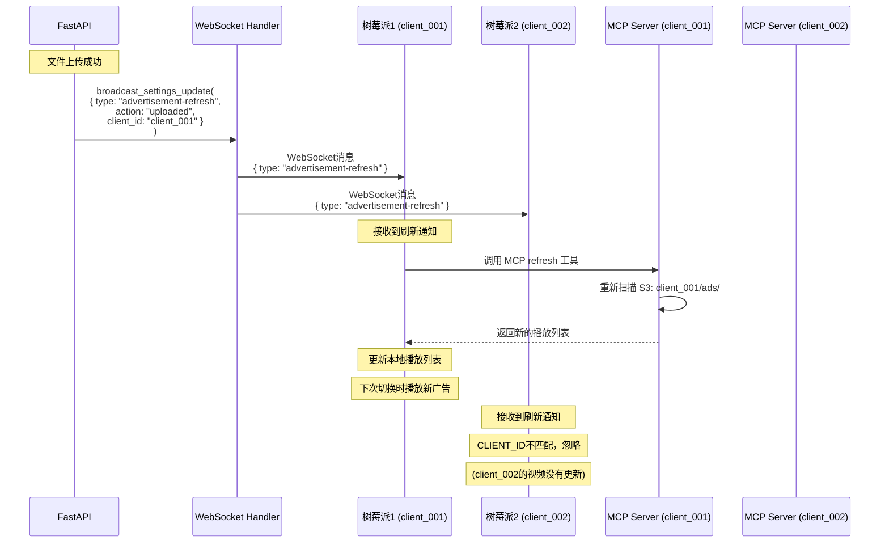

# 📹 广告视频S3上传详解

## 🎯 广告视频上传流程

### 完整流程图


---

## 🔐 CLIENT_ID 隔离机制

### 上传隔离

不同客户的广告视频上传到独立的S3前缀（相当于目录）：

```
s3://my-ads-bucket/
├─ client_001/                    # 星巴克
│  └─ ads/
│     ├─ coffee_promo.mp4         ← 店长A上传
│     ├─ summer_special.mp4       ← 店长A上传
│     └─ morning_deal.mp4         ← 店长A上传
│
├─ client_002/                    # 麦当劳
│  └─ ads/
│     ├─ burger_ad.mp4            ← 店长B上传
│     └─ breakfast_menu.mp4       ← 店长B上传
│
└─ client_003/                    # 肯德基
   └─ ads/
      └─ chicken_combo.mp4        ← 店长C上传
```

**隔离保证**:
- ✅ 店长A扫的二维码带 `?client=client_001`，只能上传到 `client_001/ads/`
- ✅ 店长B扫的二维码带 `?client=client_002`，只能上传到 `client_002/ads/`
- ❌ 店长A无法访问或修改 `client_002/` 或 `client_003/` 的文件

---

## 📝 代码实现详解

### 后端上传API

```python
# src/ai_chat/routes.py

@router.post("/api/upload")
async def upload_media(
    file: UploadFile = File(...),
    category: str = Form("ads"),          # 分类: ads=广告, agent=Agent资源
    client: Optional[str] = Form(None)    # CLIENT_ID (可选)
):
    """
    通用媒体上传接口
    
    支持:
    - 本地存储 / S3云存储 (自动切换)
    - 多租户隔离 (CLIENT_ID)
    - 文件验证 (类型/大小)
    - WebSocket刷新通知
    """
    try:
        from .storage.storage_factory import create_storage_service
        import time
        
        # ==================== 步骤1: 获取CLIENT_ID ====================
        media_config = default_context_cache.config.system_config.media_server
        
        # 优先级: API参数 > 环境变量 > 配置文件 > 默认值
        container_client_id = os.getenv('CLIENT_ID')     # Docker容器
        config_client_id = media_config.client_id        # conf.yaml
        
        client_id = (
            client                      # 1. API参数 (Web控制面板传入)
            or container_client_id      # 2. 环境变量 (Docker部署)
            or config_client_id         # 3. 配置文件 (本地开发)
            or 'default_client'         # 4. 默认值
        )
        
        logger.info(f"📤 收到上传请求 - CLIENT_ID: {client_id}, Category: {category}")
        
        # ==================== 步骤2: 验证CLIENT_ID ====================
        # 格式验证
        if not client_id.startswith('client_'):
            return Response(
                content=json.dumps({"error": "无效的CLIENT_ID格式"}),
                status_code=400,
                media_type="application/json"
            )
        
        # 白名单验证（可选，生产环境建议启用）
        valid_clients = os.getenv('VALID_CLIENTS', '')
        if valid_clients:
            valid_list = [c.strip() for c in valid_clients.split(',')]
            if client_id not in valid_list:
                logger.warning(f"❌ CLIENT_ID {client_id} 未授权")
                return Response(
                    content=json.dumps({"error": "CLIENT_ID未授权"}),
                    status_code=403,
                    media_type="application/json"
                )
        
        # ==================== 步骤3: 验证文件 ====================
        # 读取文件内容
        contents = await file.read()
        file_size = len(contents)
        file_ext = Path(file.filename).suffix.lower()
        
        # 文件类型验证
        ALLOWED_VIDEO_EXTS = {'.mp4', '.avi', '.mov', '.webm', '.mkv'}
        ALLOWED_IMAGE_EXTS = {'.jpg', '.jpeg', '.png', '.gif'}
        
        if category == 'ads':
            # 广告只允许视频
            if file_ext not in ALLOWED_VIDEO_EXTS:
                return Response(
                    content=json.dumps({
                        "error": f"不支持的视频格式: {file_ext}",
                        "allowed": list(ALLOWED_VIDEO_EXTS)
                    }),
                    status_code=400,
                    media_type="application/json"
                )
        elif category == 'agent':
            # Agent资源允许图片和视频
            if file_ext not in (ALLOWED_VIDEO_EXTS | ALLOWED_IMAGE_EXTS):
                return Response(
                    content=json.dumps({
                        "error": f"不支持的文件格式: {file_ext}"
                    }),
                    status_code=400,
                    media_type="application/json"
                )
        
        # 文件大小验证
        MAX_SIZE = 500 * 1024 * 1024  # 500MB
        if file_size > MAX_SIZE:
            return Response(
                content=json.dumps({
                    "error": f"文件过大: {file_size / (1024*1024):.2f}MB, 最大允许: 500MB"
                }),
                status_code=400,
                media_type="application/json"
            )
        
        logger.info(f"✅ 文件验证通过 - 大小: {file_size/(1024*1024):.2f}MB, 格式: {file_ext}")
        
        # ==================== 步骤4: 生成唯一文件名 ====================
        original_name = Path(file.filename).stem
        timestamp = int(time.time())
        filename = f"{original_name}_{timestamp}{file_ext}"
        
        # ==================== 步骤5: 创建存储服务 ====================
        # 工厂模式自动创建 LocalStorageService 或 S3StorageService
        storage_service = create_storage_service(
            config=media_config,
            client_id=client_id
        )
        
        logger.info(f"📦 使用存储服务: {storage_service.__class__.__name__}")
        
        # ==================== 步骤6: 上传文件 ====================
        # 统一接口，自动适配本地/S3
        storage_path = await storage_service.upload_file(
            file_data=contents,
            category=category,
            filename=filename
        )
        
        # 获取访问URL
        file_url = storage_service.get_file_url(category, filename)
        
        logger.info(f"✅ 上传成功 - 路径: {storage_path}, URL: {file_url}")
        
        # ==================== 步骤7: 广播刷新通知 ====================
        if category == 'ads' and websocket_handler:
            try:
                # 通知所有前端刷新广告列表
                refresh_message = {
                    "type": "advertisement-refresh",
                    "action": "uploaded",
                    "filename": filename,
                    "client_id": client_id
                }
                
                # 异步广播（不阻塞响应）
                asyncio.create_task(
                    websocket_handler.broadcast_settings_update(
                        refresh_message,
                        ["advertisement"]
                    )
                )
                
                logger.info(f"📡 已发送广告刷新通知")
            except Exception as e:
                logger.warning(f"广播刷新失败: {e}")
        
        # ==================== 步骤8: 返回结果 ====================
        return {
            "success": True,
            "message": "上传成功",
            "filename": filename,
            "original_name": file.filename,
            "storage_path": storage_path,
            "url": file_url,
            "size_bytes": file_size,
            "size_mb": round(file_size / (1024 * 1024), 2),
            "category": category,
            "client_id": client_id,
            "timestamp": timestamp
        }
        
    except Exception as e:
        logger.error(f"❌ 上传失败: {e}", exc_info=True)
        return Response(
            content=json.dumps({"error": f"上传失败: {str(e)}"}),
            status_code=500,
            media_type="application/json"
        )
```

---

## 🎨 前端上传界面

### Web控制面板上传

```html
<!-- web_tool/control-panel.html -->

<div class="upload-area" id="mediaUploadArea">
    <div class="upload-icon">📤</div>
    <div>点击或拖拽文件到此区域上传</div>
    <div style="font-size: 14px; color: #666; margin-top: 8px;">
        支持格式: MP4, AVI, MOV, WEBM<br>
        最大大小: 500MB
    </div>
</div>
<input type="file" id="mediaFileInput" accept="video/*" multiple>
```

```javascript
// 上传处理
async function uploadMediaFiles(fileList) {
    const statusDiv = document.getElementById('mediaUploadStatus');
    statusDiv.innerHTML = '<div class="loading">上传中...</div>';
    
    try {
        let successCount = 0;
        
        for (let i = 0; i < fileList.length; i++) {
            const file = fileList[i];
            const formData = new FormData();
            formData.append('file', file);
            formData.append('client', currentClientId);  // 当前客户ID
            formData.append('category', 'ads');          // 广告分类
            
            const response = await fetch('/api/upload', {
                method: 'POST',
                body: formData
            });
            
            if (response.ok) {
                const result = await response.json();
                console.log('上传成功:', result);
                successCount++;
            }
        }
        
        statusDiv.innerHTML = `<div class="alert-success">上传成功！上传了 ${successCount} 个文件。</div>`;
        
        // 重新加载文件列表
        loadMediaFiles();
        
    } catch (error) {
        statusDiv.innerHTML = `<div class="alert-error">上传失败: ${error.message}</div>`;
    }
}
```

---

## 📊 S3存储结构

### Bucket组织方式

```
s3://my-advertisement-bucket/
│
├─ client_001/                          # 星巴克（CLIENT_ID隔离）
│  ├─ ads/                              # 广告视频目录
│  │  ├─ coffee_promo_1730000000.mp4   # 咖啡促销广告
│  │  ├─ summer_special_1730000100.mp4 # 夏日特饮广告
│  │  └─ morning_deal_1730000200.mp4   # 早餐优惠广告
│  │
│  └─ agent/                            # Agent资源目录（未来）
│     ├─ menu_1730000300.jpg           # 菜单图片
│     └─ store_map_1730000400.png      # 店铺地图
│
├─ client_002/                          # 麦当劳
│  ├─ ads/
│  │  ├─ burger_ad_1730001000.mp4
│  │  └─ breakfast_menu_1730001100.mp4
│  │
│  └─ agent/
│     └─ product_image_1730001200.jpg
│
└─ client_003/                          # 肯德基
   ├─ ads/
   │  └─ chicken_combo_1730002000.mp4
   │
   └─ agent/
      └─ coupon_1730002100.jpg
```

### S3 Object Metadata

每个上传的文件都会包含以下元数据：

```python
{
    "Key": "client_001/ads/coffee_promo_1730000000.mp4",
    "Size": 52428800,  # 50MB
    "LastModified": "2024-10-27T10:00:00Z",
    "ContentType": "video/mp4",
    "Metadata": {
        "original-filename": "coffee_promo.mp4",
        "client-id": "client_001",
        "category": "ads",
        "uploaded-by": "web-panel",
        "upload-timestamp": "1730000000"
    },
    "StorageClass": "STANDARD"  # 或 INTELLIGENT_TIERING
}
```

---

## 🚀 CDN加速配置

### CloudFront配置示例

```yaml
# CloudFront Distribution
Domain: cdn.example.com
Origin: my-advertisement-bucket.s3.us-east-1.amazonaws.com
Path Pattern: *
Viewer Protocol: Redirect HTTP to HTTPS
Allowed Methods: GET, HEAD, OPTIONS
Cached Methods: GET, HEAD
TTL:
  Min: 0
  Default: 86400     # 1天
  Max: 31536000      # 1年

# 缓存策略
Cache Key:
  - Query Strings: None
  - Headers: None
  - Cookies: None

# 压缩
Compress Objects: Yes
```

### 访问URL示例

```
原始S3 URL:
https://my-advertisement-bucket.s3.us-east-1.amazonaws.com/client_001/ads/coffee_promo_1730000000.mp4

CDN URL:
https://cdn.example.com/client_001/ads/coffee_promo_1730000000.mp4

优势:
✅ 更短的URL
✅ 全球加速
✅ 降低S3请求成本
✅ 自动HTTPS
✅ 自动压缩
```

---

## 🔄 刷新同步机制

### WebSocket广播流程



### 前端刷新处理

```typescript
// frontend/src/renderer/src/services/websocket-handler.tsx

case "advertisement-refresh":
    console.log("📡 收到广告刷新通知:", message);
    
    // 获取当前CLIENT_ID
    const currentClientId = import.meta.env.VITE_CLIENT_ID || 'default_client';
    
    // 只刷新匹配的CLIENT_ID
    if (message.client_id === currentClientId) {
        console.log("✅ CLIENT_ID匹配，触发MCP刷新");
        
        // 调用MCP刷新工具
        await mcpClient.callTool({
            name: "refresh",
            arguments: {}
        });
        
        console.log("✅ 广告列表已刷新");
    } else {
        console.log("⏭️ CLIENT_ID不匹配，跳过刷新");
    }
    break;
```

---

## 📈 监控和日志

### 上传日志示例

```
2024-10-27 10:00:00 INFO 📤 收到上传请求 - CLIENT_ID: client_001, Category: ads
2024-10-27 10:00:01 INFO ✅ 文件验证通过 - 大小: 50.00MB, 格式: .mp4
2024-10-27 10:00:01 INFO 📦 使用存储服务: S3StorageService
2024-10-27 10:00:05 INFO ☁️ S3上传中 - Key: client_001/ads/coffee_promo_1730000000.mp4
2024-10-27 10:00:10 INFO ✅ S3上传成功 - ETag: "d41d8cd98f00b204e9800998ecf8427e"
2024-10-27 10:00:10 INFO ✅ 上传成功 - 路径: client_001/ads/coffee_promo_1730000000.mp4
2024-10-27 10:00:10 INFO ✅ CDN URL: https://cdn.example.com/client_001/ads/coffee_promo_1730000000.mp4
2024-10-27 10:00:10 INFO 📡 已发送广告刷新通知
```

---

## 🎯 总结

### 关键特性

1. **统一接口** - 本地和S3使用相同的上传API
2. **CLIENT_ID隔离** - 每个客户的视频完全隔离
3. **文件验证** - 类型、大小、格式全面检查
4. **实时刷新** - WebSocket自动通知前端更新
5. **CDN加速** - 全球快速访问

### 优势

- ✅ 店长手机直接上传，无需技术人员
- ✅ 自动多租户隔离，数据安全
- ✅ S3无限容量，不担心磁盘满
- ✅ CDN加速，播放流畅
- ✅ 实时刷新，上传即生效

---

**下一篇**: [03-Agent资源动态上传（未来）](./03-Agent资源动态上传.md)

