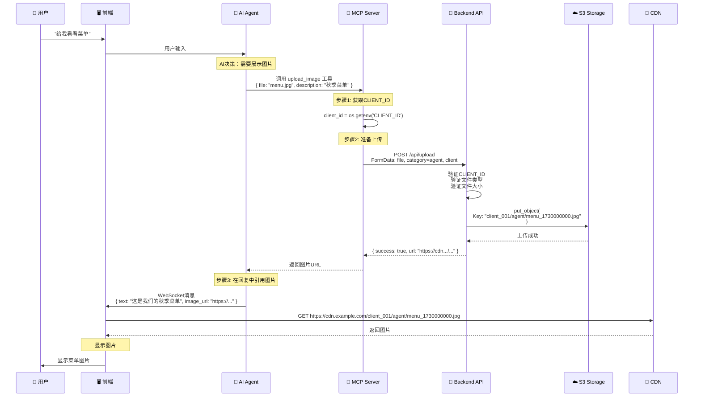

# 🖼️ Agent资源动态上传（未来功能）

## 🎯 功能概述

Agent在与用户对话过程中，可以动态上传图片或视频来增强交互体验。这些资源会存储在S3的`agent/`目录下，与广告视频隔离。

---

## 📋 使用场景

### 场景1: 展示菜单图片

```
用户: "今天有什么新品推荐吗？"

Agent: "我们今天推出了秋季限定饮品，让我给您看看菜单吧..."
    ↓
[Agent调用MCP工具上传图片]
    tool: upload_image
    file: autumn_menu.jpg
    category: "agent"
    ↓
[上传到S3]
    Key: client_001/agent/autumn_menu_1730000000.jpg
    URL: https://cdn.example.com/client_001/agent/autumn_menu_1730000000.jpg
    ↓
[前端显示]
    

用户: "看起来不错！"
```

### 场景2: 展示产品演示视频

```
用户: "这个咖啡机怎么用？"

Agent: "让我给您演示一下操作步骤..."
    ↓
[Agent上传演示视频]
    file: coffee_machine_demo.mp4
    category: "agent"
    ↓
[上传到S3]
    Key: client_001/agent/coffee_machine_demo_1730000100.mp4
    URL: https://cdn.example.com/client_001/agent/coffee_machine_demo_1730000100.mp4
    ↓
[前端播放]
    <video src="https://cdn.example.com/..." controls />

用户: "明白了，谢谢！"
```

### 场景3: 展示店铺地图

```
用户: "洗手间在哪里？"

Agent: "为您导航，请看这张店铺地图..."
    ↓
[Agent上传地图图片]
    file: store_map.png
    category: "agent"
    description: "店铺导航地图"
    ↓
[上传到S3 + 显示]

用户: "找到了，谢谢！"
```

---

## 🏗️ 技术架构

### Agent资源上传流程



---

## 🔧 MCP工具实现

### upload_image 工具

```python
# src/ai_chat/mcpp/agent_resource_server.py (未来文件)

from mcp.server import Server
from mcp.types import Tool, TextContent
import aiohttp
import os
import json

class AgentResourceServer:
    """Agent资源管理服务器"""
    
    def __init__(self, base_url: str = "http://localhost:12393"):
        self.server = Server("agent-resource-server")
        self.base_url = base_url
        self.client_id = os.getenv('CLIENT_ID', 'default_client')
        
        self._register_tools()
    
    def _register_tools(self):
        """注册MCP工具"""
        
        @self.server.list_tools()
        async def handle_list_tools() -> list[Tool]:
            """列出可用工具"""
            return [
                Tool(
                    name="upload_image",
                    description="""
                    上传图片资源供用户查看。
                    
                    使用场景:
                    - 展示菜单、产品图片
                    - 显示地图、导航图
                    - 展示活动海报
                    
                    支持格式: JPG, PNG, GIF
                    最大大小: 10MB
                    """,
                    inputSchema={
                        "type": "object",
                        "properties": {
                            "image_data": {
                                "type": "string",
                                "description": "Base64编码的图片数据"
                            },
                            "filename": {
                                "type": "string",
                                "description": "文件名 (例如: menu.jpg)"
                            },
                            "description": {
                                "type": "string",
                                "description": "图片描述 (用于生成文件名)"
                            }
                        },
                        "required": ["image_data", "filename", "description"]
                    }
                ),
                
                Tool(
                    name="upload_video",
                    description="""
                    上传视频资源供用户观看。
                    
                    使用场景:
                    - 产品演示视频
                    - 操作指南视频
                    - 宣传视频
                    
                    支持格式: MP4, WEBM
                    最大大小: 50MB
                    """,
                    inputSchema={
                        "type": "object",
                        "properties": {
                            "video_data": {
                                "type": "string",
                                "description": "Base64编码的视频数据"
                            },
                            "filename": {
                                "type": "string",
                                "description": "文件名 (例如: demo.mp4)"
                            },
                            "description": {
                                "type": "string",
                                "description": "视频描述"
                            }
                        },
                        "required": ["video_data", "filename", "description"]
                    }
                ),
                
                Tool(
                    name="list_agent_resources",
                    description="""
                    列出已上传的Agent资源。
                    
                    用于查看历史上传的图片和视频，
                    可以复用之前上传的资源。
                    """,
                    inputSchema={
                        "type": "object",
                        "properties": {
                            "resource_type": {
                                "type": "string",
                                "enum": ["image", "video", "all"],
                                "description": "资源类型",
                                "default": "all"
                            }
                        }
                    }
                )
            ]
        
        @self.server.call_tool()
        async def handle_call_tool(name: str, arguments: dict) -> list[TextContent]:
            """处理工具调用"""
            
            if name == "upload_image":
                return await self._upload_image(
                    image_data=arguments["image_data"],
                    filename=arguments["filename"],
                    description=arguments["description"]
                )
            
            elif name == "upload_video":
                return await self._upload_video(
                    video_data=arguments["video_data"],
                    filename=arguments["filename"],
                    description=arguments["description"]
                )
            
            elif name == "list_agent_resources":
                return await self._list_resources(
                    resource_type=arguments.get("resource_type", "all")
                )
            
            else:
                raise ValueError(f"Unknown tool: {name}")
    
    async def _upload_image(
        self, 
        image_data: str, 
        filename: str, 
        description: str
    ) -> list[TextContent]:
        """上传图片到S3"""
        import base64
        import time
        
        try:
            # 1. 解码Base64数据
            file_bytes = base64.b64decode(image_data)
            
            # 2. 生成唯一文件名
            ext = os.path.splitext(filename)[1]
            safe_description = description.replace(' ', '_').replace('/', '_')
            timestamp = int(time.time())
            unique_filename = f"{safe_description}_{timestamp}{ext}"
            
            # 3. 调用上传API
            url = f"{self.base_url}/api/upload"
            
            form_data = aiohttp.FormData()
            form_data.add_field('file', file_bytes, filename=unique_filename)
            form_data.add_field('category', 'agent')
            form_data.add_field('client', self.client_id)
            
            async with aiohttp.ClientSession() as session:
                async with session.post(url, data=form_data) as response:
                    if response.status == 200:
                        result = await response.json()
                        
                        return [TextContent(
                            type="text",
                            text=json.dumps({
                                "success": True,
                                "url": result["url"],
                                "filename": result["filename"],
                                "type": "image",
                                "description": description,
                                "message": "图片上传成功，已返回URL供显示"
                            }, ensure_ascii=False)
                        )]
                    else:
                        error = await response.text()
                        return [TextContent(
                            type="text",
                            text=json.dumps({
                                "success": False,
                                "error": f"上传失败: {error}"
                            })
                        )]
        
        except Exception as e:
            return [TextContent(
                type="text",
                text=json.dumps({
                    "success": False,
                    "error": f"上传异常: {str(e)}"
                })
            )]
    
    async def _upload_video(
        self, 
        video_data: str, 
        filename: str, 
        description: str
    ) -> list[TextContent]:
        """上传视频到S3（实现类似upload_image）"""
        # 实现与upload_image类似
        pass
    
    async def _list_resources(
        self, 
        resource_type: str = "all"
    ) -> list[TextContent]:
        """列出Agent资源"""
        try:
            url = f"{self.base_url}/api/media/list"
            params = {
                "category": "agent",
                "client": self.client_id
            }
            
            async with aiohttp.ClientSession() as session:
                async with session.get(url, params=params) as response:
                    if response.status == 200:
                        data = await response.json()
                        files = data.get("files", [])
                        
                        # 过滤文件类型
                        if resource_type == "image":
                            files = [f for f in files if f["filename"].lower().endswith(('.jpg', '.jpeg', '.png', '.gif'))]
                        elif resource_type == "video":
                            files = [f for f in files if f["filename"].lower().endswith(('.mp4', '.webm', '.avi', '.mov'))]
                        
                        return [TextContent(
                            type="text",
                            text=json.dumps({
                                "success": True,
                                "count": len(files),
                                "files": files
                            }, ensure_ascii=False)
                        )]
        
        except Exception as e:
            return [TextContent(
                type="text",
                text=json.dumps({
                    "success": False,
                    "error": str(e)
                })
            )]
```

---

## 💬 Agent对话集成

### Prompt示例

```markdown
# Agent System Prompt

你是一个智能AI助手，可以使用以下MCP工具来增强用户体验：

## 可用工具

### upload_image
上传图片供用户查看。当用户要求查看菜单、产品图片、地图等时使用。

使用场景:
- 用户: "今天有什么新品？" → 上传新品菜单图片
- 用户: "洗手间在哪？" → 上传店铺地图
- 用户: "这个产品长什么样？" → 上传产品图片

调用示例:
{
    "tool": "upload_image",
    "image_data": "<base64_encoded_data>",
    "filename": "menu.jpg",
    "description": "秋季新品菜单"
}

### upload_video
上传视频供用户观看。当需要展示操作步骤、产品演示时使用。

使用场景:
- 用户: "这个咖啡机怎么用？" → 上传操作演示视频
- 用户: "给我看看店铺环境" → 上传店铺介绍视频

## 工作流程

1. 判断是否需要视觉资源
2. 如果需要，调用upload_image或upload_video工具
3. 获取返回的URL
4. 在回复中引用该URL
5. 前端自动显示图片或视频

示例对话:
用户: "今天有什么新品推荐吗？"
你: "我们今天推出了秋季限定系列，让我给您看看..."
[调用upload_image工具]
[获取URL: https://cdn.example.com/client_001/agent/autumn_menu_1730000000.jpg]
你: "这是我们的秋季限定菜单 [IMAGE:https://cdn.example.com/.../autumn_menu_1730000000.jpg]"
```

### 前端消息解析

```typescript
// frontend/src/renderer/src/services/websocket-handler.tsx

case "agent-message":
    const messageText = message.text;
    
    // 解析图片标记 [IMAGE:url]
    const imageRegex = /\[IMAGE:(https?:\/\/[^\]]+)\]/g;
    const images = [];
    let match;
    
    while ((match = imageRegex.exec(messageText)) !== null) {
        images.push(match[1]);
    }
    
    // 解析视频标记 [VIDEO:url]
    const videoRegex = /\[VIDEO:(https?:\/\/[^\]]+)\]/g;
    const videos = [];
    
    while ((match = videoRegex.exec(messageText)) !== null) {
        videos.push(match[1]);
    }
    
    // 显示消息和媒体
    displayAgentMessage({
        text: messageText.replace(imageRegex, '').replace(videoRegex, ''),
        images: images,
        videos: videos
    });
    break;
```

---

## 📁 存储结构

### Agent资源组织

```
s3://my-bucket/
├─ client_001/
│  ├─ ads/                                # 广告视频（现有）
│  │  ├─ coffee_promo.mp4
│  │  └─ summer_special.mp4
│  │
│  └─ agent/                              # Agent资源（新增）
│     ├─ menu_1730000000.jpg             # 菜单图片
│     ├─ autumn_menu_1730000100.jpg      # 秋季菜单
│     ├─ store_map_1730000200.png        # 店铺地图
│     ├─ product_demo_1730000300.mp4     # 产品演示视频
│     ├─ coffee_machine_guide_1730000400.mp4  # 咖啡机指南
│     └─ coupon_1730000500.jpg           # 优惠券图片
│
├─ client_002/
│  ├─ ads/
│  └─ agent/
│     ├─ burger_menu_1730001000.jpg
│     └─ breakfast_guide_1730001100.mp4
```

### 资源分类

```python
# 资源类型
AGENT_RESOURCE_TYPES = {
    "menu": {
        "description": "菜单图片",
        "formats": [".jpg", ".png"],
        "max_size": 10 * 1024 * 1024  # 10MB
    },
    "map": {
        "description": "地图导航",
        "formats": [".png", ".jpg"],
        "max_size": 5 * 1024 * 1024  # 5MB
    },
    "demo": {
        "description": "演示视频",
        "formats": [".mp4", ".webm"],
        "max_size": 50 * 1024 * 1024  # 50MB
    },
    "product": {
        "description": "产品图片",
        "formats": [".jpg", ".png"],
        "max_size": 10 * 1024 * 1024  # 10MB
    }
}
```

---

## 🔐 安全和权限

### 上传限制

```python
# Agent资源上传限制
AGENT_UPLOAD_LIMITS = {
    "max_files_per_day": 100,        # 每天最多上传100个文件
    "max_total_size_per_day": 1024,  # 每天最多1GB
    "max_file_size": 50,              # 单个文件最大50MB
    "allowed_types": [                # 允许的文件类型
        "image/jpeg",
        "image/png",
        "image/gif",
        "video/mp4",
        "video/webm"
    ]
}
```

### 访问控制

```python
# CLIENT_ID隔离
# Agent只能访问自己CLIENT_ID下的资源

# ✅ 允许
GET /api/media/list?category=agent&client=client_001
→ 返回: client_001/agent/* 的文件

# ❌ 拒绝
GET /api/media/list?category=agent&client=client_002
→ 返回: 403 Forbidden (如果请求来自client_001)
```

---

## 🎯 总结

### 核心特性

1. **MCP工具集成** - Agent通过MCP调用上传
2. **自动S3存储** - 统一使用storage抽象层
3. **CLIENT_ID隔离** - 每个客户独立资源
4. **CDN加速** - 快速加载图片/视频
5. **前端自动显示** - 解析消息中的媒体标记

### 使用场景

- 📋 **菜单展示** - 动态上传最新菜单
- 🗺️ **导航指引** - 店铺地图、楼层指南
- 🎥 **视频演示** - 产品使用、操作指南
- 🎟️ **优惠活动** - 优惠券、活动海报
- 🏪 **店铺介绍** - 环境照片、团队介绍

### 优势

- ✅ **动态灵活** - Agent根据对话自主决策
- ✅ **无需预存** - 即时上传，即时使用
- ✅ **统一管理** - 与广告视频相同的存储架构
- ✅ **自动清理** - 可设置过期策略（未来）

---

**下一篇**: [04-项目整体架构与部署](./04-项目整体架构与部署.md)

