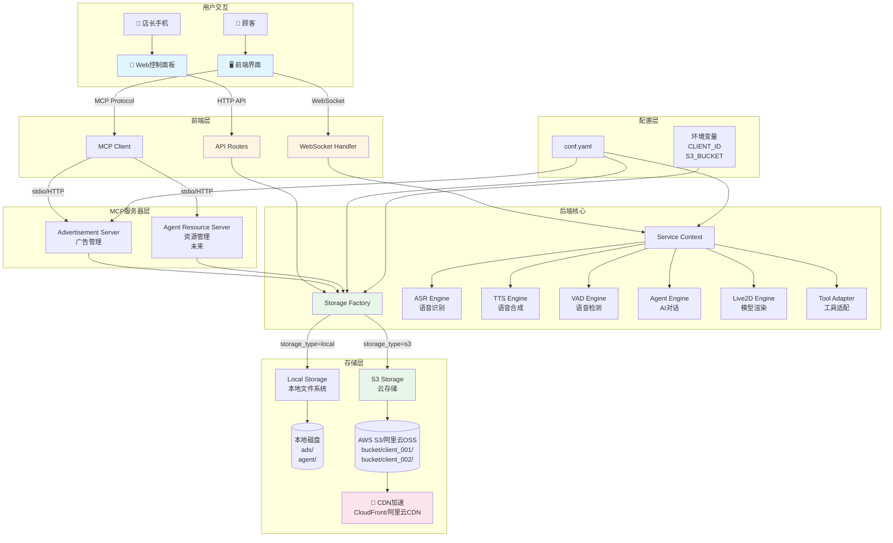
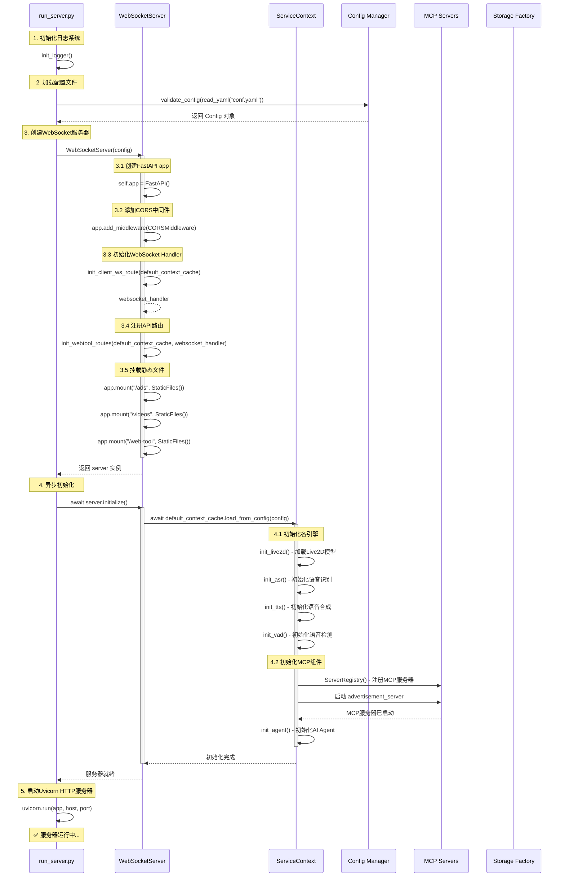
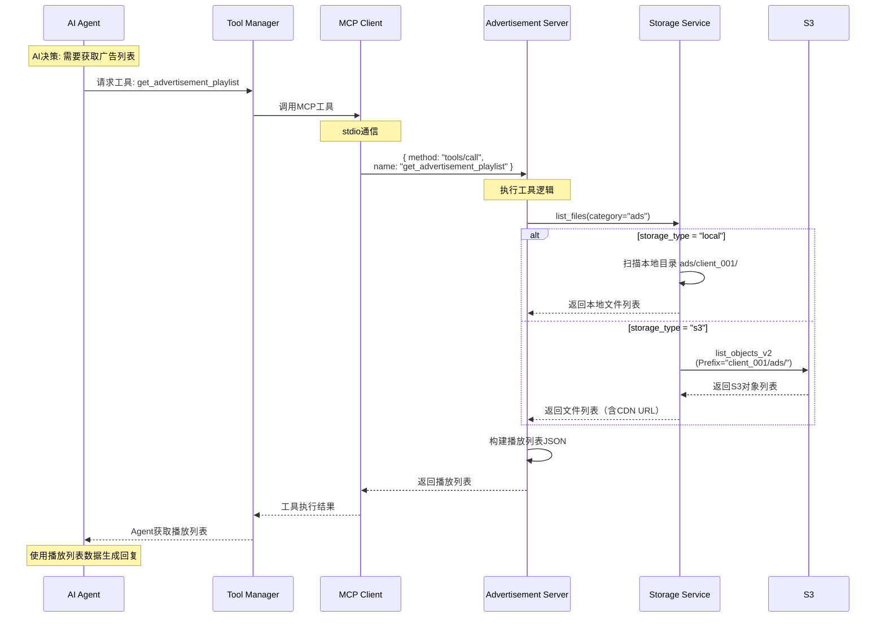
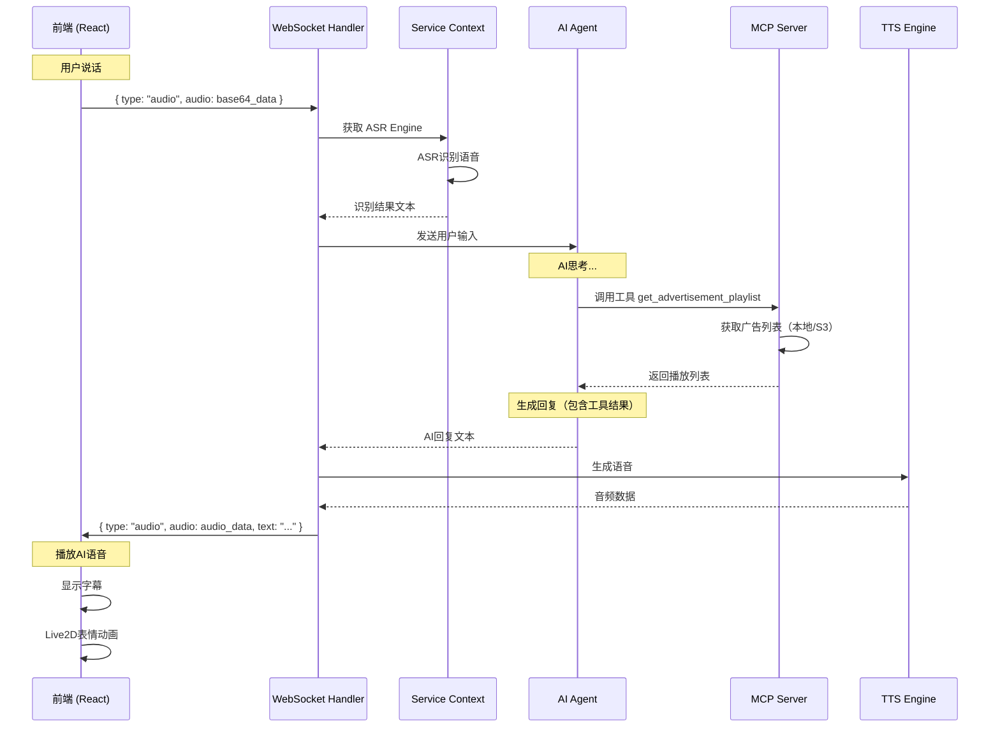

# 🏗️ 项目整体架构与部署

## 🎯 项目架构总览

### 系统架构图

```
┌─────────────────────────────────────────────────────────────────────────────────┐
│                              前端层 (Frontend Layer)                              │
│                                                                                   │
│  ┌───────────────────────────────────────────────────────────────────────────┐  │
│  │  Electron 前端 (树莓派/桌面)                                                │  │
│  │  ├─ React + TypeScript                                                     │  │
│  │  ├─ Zustand 状态管理                                                       │  │
│  │  ├─ Live2D 模型渲染                                                        │  │
│  │  ├─ WebRTC VAD 语音检测                                                    │  │
│  │  ├─ WebSocket 双向通信                                                     │  │
│  │  └─ MCP Client (与后端MCP Server通信)                                     │  │
│  └───────────────────────────────────────────────────────────────────────────┘  │
│                                       ↕                                           │
│                         WebSocket (ws://localhost:12393/client-ws)               │
│                                       ↕                                           │
│  ┌───────────────────────────────────────────────────────────────────────────┐  │
│  │  Web 控制面板 (手机/平板)                                                  │  │
│  │  ├─ 纯 HTML/CSS/JavaScript                                                │  │
│  │  ├─ 响应式设计                                                            │  │
│  │  ├─ HTTP API 调用                                                         │  │
│  │  └─ 功能: 广告上传、角色切换、二维码                                      │  │
│  └───────────────────────────────────────────────────────────────────────────┘  │
└─────────────────────────────────────────────────────────────────────────────────┘

                                       ↕
                         HTTP/WebSocket (HTTPS in production)
                                       ↕

┌─────────────────────────────────────────────────────────────────────────────────┐
│                            后端层 (Backend Layer)                                 │
│                                                                                   │
│  ┌───────────────────────────────────────────────────────────────────────────┐  │
│  │  FastAPI 服务器 (run_server.py)                                           │  │
│  │                                                                             │  │
│  │  ┌─────────────────────────────────────────────────────────────────────┐  │  │
│  │  │  WebSocket Handler                                                   │  │  │
│  │  │  ├─ 连接管理 (client_connections, client_contexts)                  │  │  │
│  │  │  ├─ 消息路由 (message handlers)                                      │  │  │
│  │  │  ├─ 心跳检测 (heartbeat)                                             │  │  │
│  │  │  └─ 广播功能 (broadcast_to_all)                                      │  │  │
│  │  └─────────────────────────────────────────────────────────────────────┘  │  │
│  │                                                                             │  │
│  │  ┌─────────────────────────────────────────────────────────────────────┐  │  │
│  │  │  API Routes (routes.py)                                              │  │  │
│  │  │  ├─ /client-ws           - WebSocket连接                            │  │  │
│  │  │  ├─ /api/upload          - 媒体上传                                  │  │  │
│  │  │  ├─ /api/media/list      - 媒体列表                                  │  │  │
│  │  │  ├─ /api/media/delete    - 媒体删除                                  │  │  │
│  │  │  ├─ /api/settings/save   - 设置保存（角色切换）                      │  │  │
│  │  │  ├─ /api/settings/load   - 设置加载                                  │  │  │
│  │  │  ├─ /api/config-files    - 角色预设列表                              │  │  │
│  │  │  └─ /api/qrcode/upload   - 二维码生成                                │  │  │
│  │  └─────────────────────────────────────────────────────────────────────┘  │  │
│  │                                                                             │  │
│  │  ┌─────────────────────────────────────────────────────────────────────┐  │  │
│  │  │  Service Context (service_context.py)                                │  │  │
│  │  │  ├─ Live2D Engine       - 模型渲染                                   │  │  │
│  │  │  ├─ ASR Engine          - 语音识别                                   │  │  │
│  │  │  ├─ TTS Engine          - 语音合成                                   │  │  │
│  │  │  ├─ VAD Engine          - 语音检测                                   │  │  │
│  │  │  ├─ Agent Engine        - AI对话                                     │  │  │
│  │  │  ├─ MCP Client          - MCP协议客户端                              │  │  │
│  │  │  └─ Tool Adapter        - 工具适配器                                 │  │  │
│  │  └─────────────────────────────────────────────────────────────────────┘  │  │
│  │                                                                             │  │
│  │  ┌─────────────────────────────────────────────────────────────────────┐  │  │
│  │  │  Storage Layer (存储抽象层)                                          │  │  │
│  │  │                                                                       │  │  │
│  │  │  ┌──────────────────┐    ┌─────────────────┐                        │  │  │
│  │  │  │ StorageInterface │◄───┤ StorageFactory  │                        │  │  │
│  │  │  │  (抽象接口)       │    │  (工厂模式)      │                        │  │  │
│  │  │  └──────────────────┘    └─────────────────┘                        │  │  │
│  │  │           △                                                           │  │  │
│  │  │           │                                                           │  │  │
│  │  │           ├─────────────────┬─────────────────┐                      │  │  │
│  │  │           │                 │                 │                      │  │  │
│  │  │  ┌────────┴─────────┐ ┌────┴──────────┐ ┌────┴──────────┐          │  │  │
│  │  │  │ LocalStorage     │ │ S3Storage     │ │ MinIOStorage  │          │  │  │
│  │  │  │  (本地文件)       │ │  (云存储)      │ │  (自建S3)     │          │  │  │
│  │  │  └──────────────────┘ └───────────────┘ └───────────────┘          │  │  │
│  │  └─────────────────────────────────────────────────────────────────────┘  │  │
│  └─────────────────────────────────────────────────────────────────────────────┘  │
└─────────────────────────────────────────────────────────────────────────────────┘

                                       ↕
                            MCP 协议 (stdio/HTTP)
                                       ↕

┌─────────────────────────────────────────────────────────────────────────────────┐
│                          MCP 服务器层 (MCP Servers)                              │
│                                                                                   │
│  ┌─────────────────────────────────────────────────────────────────────────┐    │
│  │  Advertisement Server (advertisement_server.py)                          │    │
│  │  ├─ 管理广告播放列表                                                      │    │
│  │  ├─ 扫描广告目录（本地/S3）                                               │    │
│  │  ├─ 工具: get_advertisement_playlist, search, refresh                   │    │
│  │  └─ CLIENT_ID隔离                                                        │    │
│  └─────────────────────────────────────────────────────────────────────────┘    │
│                                                                                   │
│  ┌─────────────────────────────────────────────────────────────────────────┐    │
│  │  Agent Resource Server (未来)                                            │    │
│  │  ├─ 管理Agent动态上传的资源                                               │    │
│  │  ├─ 工具: upload_image, upload_video, list_resources                    │    │
│  │  └─ CLIENT_ID隔离                                                        │    │
│  └─────────────────────────────────────────────────────────────────────────┘    │
└─────────────────────────────────────────────────────────────────────────────────┘

                                       ↕
                              Storage Operations
                                       ↕

┌─────────────────────────────────────────────────────────────────────────────────┐
│                          存储层 (Storage Layer)                                   │
│                                                                                   │
│  ┌───────────────────────────┐          ┌──────────────────────────────┐        │
│  │  本地文件系统               │          │  S3 云存储                    │        │
│  │                            │          │                              │        │
│  │  ads/                      │          │  s3://my-bucket/             │        │
│  │  ├─ client_001/            │          │  ├─ client_001/              │        │
│  │  │  ├─ video1.mp4          │          │  │  ├─ ads/video1.mp4        │        │
│  │  │  └─ video2.mp4          │          │  │  └─ agent/menu.jpg        │        │
│  │  └─ client_002/            │          │  └─ client_002/              │        │
│  │     └─ ad.mp4              │          │     └─ ads/ad.mp4            │        │
│  │                            │          │                              │        │
│  │  agent/                    │          │  ↓                           │        │
│  │  ├─ client_001/            │          │  CDN: https://cdn.example.com│        │
│  │  │  ├─ menu.jpg            │          │  ├─ client_001/ads/video1.mp4│        │
│  │  │  └─ map.png             │          │  └─ client_002/ads/ad.mp4   │        │
│  │  └─ client_002/            │          │                              │        │
│  │     └─ image.jpg           │          │  ✅ 无限容量                  │        │
│  │                            │          │  ✅ 全球加速                  │        │
│  │  ✅ 低成本                  │          │  ✅ 高可用                    │        │
│  │  ✅ 简单部署                │          │  💰 付费服务                  │        │
│  └───────────────────────────┘          └──────────────────────────────┘        │
└─────────────────────────────────────────────────────────────────────────────────┘
```

---

## 🔄 数据流向图

### 完整业务流程



---

## 🚀 启动流程

### 服务器启动序列



---

## 📦 核心组件详解

### 1. Service Context（服务上下文）

**职责**: 集中管理所有引擎实例，提供统一的服务访问接口

```python
# src/ai_chat/service_context.py
class ServiceContext:
    """
    服务上下文 - 管理所有引擎的生命周期
    
    核心职责:
    1. 初始化各引擎（Live2D、ASR、TTS、VAD、Agent）
    2. 管理MCP客户端和工具适配器
    3. 提供配置切换功能
    4. 缓存重量级资源（避免重复初始化）
    """
    
    # 引擎实例
    live2d_model: Live2dModel          # Live2D模型
    asr_engine: ASRInterface           # 语音识别引擎
    tts_engine: TTSInterface           # 语音合成引擎
    vad_engine: VADInterface           # 语音检测引擎
    agent_engine: AgentInterface       # AI对话引擎
    
    # MCP组件
    mcp_server_registery: ServerRegistry    # MCP服务器注册表
    tool_adapter: ToolAdapter                # 工具适配器
    mcp_client: MCPClient                    # MCP协议客户端
    tool_manager: ToolManager                # 工具管理器
    tool_executor: ToolExecutor              # 工具执行器
    
    # 配置
    config: Config                      # 完整配置
    character_config: CharacterConfig   # 角色配置
    system_config: SystemConfig         # 系统配置
```

**初始化流程**:
```python
async def load_from_config(self, config: Config):
    """从配置加载所有引擎"""
    
    # 1. 加载Live2D模型（离线加载，不阻塞）
    await asyncio.to_thread(self.init_live2d, config.character_config.live2d_model_name)
    
    # 2. 初始化ASR引擎
    await asyncio.to_thread(self.init_asr, config.character_config.asr_config)
    
    # 3. 初始化TTS引擎
    await asyncio.to_thread(self.init_tts, config.character_config.tts_config)
    
    # 4. 初始化VAD引擎
    await asyncio.to_thread(self.init_vad, config.character_config.vad_config)
    
    # 5. 初始化MCP组件
    if config.character_config.agent_config.agent_settings.basic_memory_agent.use_mcpp:
        self.mcp_server_registery = ServerRegistry()
        self.tool_adapter = ToolAdapter(server_registery=self.mcp_server_registery)
    
    # 6. 初始化Agent引擎
    await asyncio.to_thread(self.init_agent, config.character_config.agent_config)
```

---

### 2. WebSocket Handler（WebSocket处理器）

**职责**: 管理所有WebSocket连接，处理消息路由和广播

```python
# src/ai_chat/websocket_handler.py
class WebSocketHandler:
    """
    WebSocket连接管理器
    
    核心职责:
    1. 管理所有客户端连接
    2. 路由消息到对应的处理器
    3. 广播消息到所有连接的客户端
    4. 心跳检测和自动清理
    """
    
    # 连接管理
    client_connections: Dict[str, WebSocket]       # client_uid → WebSocket
    client_contexts: Dict[str, ServiceContext]     # client_uid → ServiceContext
    
    # 消息处理器
    message_handlers: Dict[str, Callable]
    
    # 共享资源
    default_context_cache: ServiceContext          # 默认上下文缓存
```

**消息路由表**:
```python
MESSAGE_HANDLERS = {
    # 语音相关
    "audio": handle_audio,                    # 用户语音输入
    "vad-stop": handle_vad_stop,              # VAD停止
    
    # 对话相关
    "interrupt": handle_interrupt,            # 用户打断
    "text": handle_text,                      # 文本输入
    
    # 控制相关
    "switch-config": handle_config_switch,    # 切换角色配置
    "control": handle_control,                # 控制命令
    
    # Agent相关
    "agent-trigger": handle_agent_trigger,    # 触发Agent发话
    "mcp-call": handle_mcp_call,              # MCP工具调用
    
    # 状态相关
    "heartbeat": handle_heartbeat,            # 心跳
    "state-update": _ignore_message,          # 状态更新（前端→后端）
}
```

---

### 3. Storage Factory（存储工厂）

**职责**: 根据配置自动创建对应的存储服务实例

```python
# src/ai_chat/storage/storage_factory.py
def create_storage_service(
    config: MediaServerConfig, 
    client_id: str = None
) -> StorageInterface:
    """
    存储服务工厂
    
    决策逻辑:
    1. 读取 config.storage_type
    2. 如果是 "s3" → 创建 S3StorageService
    3. 如果是 "local" → 创建 LocalStorageService
    4. 返回统一的 StorageInterface 接口
    
    使用方:
    - API Routes: 上传/列表/删除API
    - MCP Servers: 广告服务器、资源服务器
    """
    
    storage_type = config.storage_type.lower()
    
    if storage_type == "s3":
        return S3StorageService(
            client_id=client_id,
            bucket=config.s3_bucket or os.getenv('S3_BUCKET'),
            region=config.s3_region or os.getenv('S3_REGION'),
            access_key=config.s3_access_key or os.getenv('S3_ACCESS_KEY'),
            secret_key=config.s3_secret_key or os.getenv('S3_SECRET_KEY'),
            cdn_url=config.cdn_url or os.getenv('CDN_URL')
        )
    
    elif storage_type == "local":
        return LocalStorageService(
            client_id=client_id,
            base_directory=config.base_directory or "."
        )
```

---

### 4. MCP Architecture（MCP架构）

**职责**: 提供工具调用能力，让Agent可以执行外部操作

```python
# MCP 组件关系
ServiceContext
    ↓ 创建
ServerRegistry (注册所有MCP服务器)
    ↓ 注册
    ├─ advertisement_server (stdio通信)
    ├─ agent_resource_server (未来)
    └─ other_servers...
    ↓ 管理
ToolAdapter (适配MCP协议)
    ↓ 使用
MCPClient (协议客户端)
    ↓ 调用
ToolManager (工具管理)
    ↓ 执行
ToolExecutor (工具执行)
    ↓ 返回结果
Agent Engine (AI使用工具结果)
```

**MCP通信流程**:


---

## 🌍 部署架构

### 部署模式1: 单机本地部署

**适用场景**: 本地开发、小型展示、测试环境

```
┌─────────────────────────────────────────────────┐
│          Raspberry Pi / Desktop PC               │
│                                                  │
│  ┌────────────────────────────────────────────┐ │
│  │  Frontend (Electron)                       │ │
│  │  Port: 3000 (dev) / N/A (production)       │ │
│  │  ├─ React Dev Server (开发)                │ │
│  │  └─ Electron App (生产)                    │ │
│  └────────────────────────────────────────────┘ │
│              ↕ WebSocket                        │
│  ┌────────────────────────────────────────────┐ │
│  │  Backend (FastAPI)                         │ │
│  │  Port: 12393                               │ │
│  │  ├─ WebSocket: /client-ws                  │ │
│  │  ├─ API: /api/*                            │ │
│  │  ├─ Static: /ads, /videos, /web-tool       │ │
│  │  └─ MCP Servers (stdio)                    │ │
│  └────────────────────────────────────────────┘ │
│              ↕                                   │
│  ┌────────────────────────────────────────────┐ │
│  │  Local Storage                             │ │
│  │  ├─ ads/client_001/                        │ │
│  │  ├─ agent/client_001/                      │ │
│  │  └─ cache/                                 │ │
│  └────────────────────────────────────────────┘ │
└─────────────────────────────────────────────────┘

访问方式:
- Frontend: http://localhost:3000 (dev)
- Web控制面板: http://localhost:12393/web-tool/control-panel.html?client=client_001
```

---

### 部署模式2: Docker单容器部署

**适用场景**: 简单部署、单客户场景

```
┌─────────────────────────────────────────────────────────┐
│                  Docker Host                             │
│                                                          │
│  ┌────────────────────────────────────────────────────┐ │
│  │  Container: ai-screen-client001                    │ │
│  │                                                     │ │
│  │  ┌──────────────────────────────────────────────┐ │ │
│  │  │  Frontend (Nginx静态文件)                     │ │ │
│  │  │  Port: 80                                     │ │ │
│  │  └──────────────────────────────────────────────┘ │ │
│  │           ↕                                        │ │
│  │  ┌──────────────────────────────────────────────┐ │ │
│  │  │  Backend (FastAPI)                            │ │ │
│  │  │  Port: 12393 (内部)                           │ │ │
│  │  │  ENV:                                         │ │ │
│  │  │    CLIENT_ID=client_001                       │ │ │
│  │  │    STORAGE_TYPE=local                         │ │ │
│  │  └──────────────────────────────────────────────┘ │ │
│  │           ↕                                        │ │
│  │  ┌──────────────────────────────────────────────┐ │ │
│  │  │  Volume: /app/ads                             │ │ │
│  │  │  映射到: ./data/client_001/ads                 │ │ │
│  │  └──────────────────────────────────────────────┘ │ │
│  └────────────────────────────────────────────────────┘ │
│                                                          │
│  Host映射:                                               │
│  - 80:80 (HTTP)                                         │
│  - 443:443 (HTTPS，需配置证书)                          │
└─────────────────────────────────────────────────────────┘

访问方式:
- http://server-ip/
- http://server-ip/web-tool/control-panel.html?client=client_001
```

---

### 部署模式3: Docker多容器部署（多租户）

**适用场景**: 一台服务器运行多个客户实例

```
┌──────────────────────────────────────────────────────────────────────┐
│                        Docker Host (1台服务器)                        │
│                                                                       │
│  ┌─────────────────────────────────────────────────────────────────┐│
│  │  Reverse Proxy (Caddy/Nginx)                                    ││
│  │  Port: 80, 443                                                  ││
│  │                                                                  ││
│  │  路由规则:                                                        ││
│  │  ├─ screen1.example.com → Container 1                          ││
│  │  ├─ screen2.example.com → Container 2                          ││
│  │  └─ screen3.example.com → Container 3                          ││
│  └─────────────────────────────────────────────────────────────────┘│
│           │                    │                    │                │
│           ↓                    ↓                    ↓                │
│  ┌──────────────────┐ ┌──────────────────┐ ┌──────────────────┐   │
│  │  Container 1     │ │  Container 2     │ │  Container 3     │   │
│  │  星巴克           │ │  麦当劳           │ │  肯德基           │   │
│  │                  │ │                  │ │                  │   │
│  │  Frontend:80     │ │  Frontend:80     │ │  Frontend:80     │   │
│  │  Backend:12393   │ │  Backend:12393   │ │  Backend:12393   │   │
│  │                  │ │                  │ │                  │   │
│  │  ENV:            │ │  ENV:            │ │  ENV:            │   │
│  │  CLIENT_ID=      │ │  CLIENT_ID=      │ │  CLIENT_ID=      │   │
│  │    client_001    │ │    client_002    │ │    client_003    │   │
│  │  STORAGE_TYPE=   │ │  STORAGE_TYPE=   │ │  STORAGE_TYPE=   │   │
│  │    s3            │ │    s3            │ │    s3            │   │
│  └──────────────────┘ └──────────────────┘ └──────────────────┘   │
│           │                    │                    │                │
│           └────────────────────┴────────────────────┘                │
│                              ↓                                       │
│                     共享S3存储（按CLIENT_ID隔离）                     │
└──────────────────────────────────────────────────────────────────────┘
                              ↓
        ┌─────────────────────────────────────────────┐
        │       AWS S3 / 阿里云OSS                      │
        │                                              │
        │  s3://my-bucket/                             │
        │  ├─ client_001/ (星巴克)                     │
        │  │  ├─ ads/video1.mp4                        │
        │  │  └─ agent/menu.jpg                        │
        │  ├─ client_002/ (麦当劳)                     │
        │  │  └─ ads/burger.mp4                        │
        │  └─ client_003/ (肯德基)                     │
        │     └─ ads/chicken.mp4                       │
        │                                              │
        │  ✅ 三个容器共享一个S3桶                      │
        │  ✅ CLIENT_ID前缀隔离，互不干扰               │
        └─────────────────────────────────────────────┘
                              ↓
        ┌─────────────────────────────────────────────┐
        │       CDN (CloudFront/阿里云CDN)              │
        │                                              │
        │  https://cdn.example.com/                    │
        │  ├─ client_001/ads/video1.mp4                │
        │  ├─ client_002/ads/burger.mp4                │
        │  └─ client_003/ads/chicken.mp4               │
        │                                              │
        │  ✅ 全球加速                                  │
        │  ✅ HTTPS自动                                 │
        └─────────────────────────────────────────────┘
```

**docker-compose.yml 示例**:
```yaml
version: '3.8'

services:
  # 星巴克容器
  screen_client001:
    build: .
    environment:
      - CLIENT_ID=client_001
      - STORAGE_TYPE=s3
      - S3_BUCKET=my-ads-bucket
      - S3_REGION=us-east-1
      - CDN_URL=https://cdn.example.com
      - AWS_ACCESS_KEY=${AWS_ACCESS_KEY}
      - AWS_SECRET_KEY=${AWS_SECRET_KEY}
    ports:
      - "8001:80"
    volumes:
      - ./cache/client_001:/app/cache
  
  # 麦当劳容器
  screen_client002:
    build: .
    environment:
      - CLIENT_ID=client_002
      - STORAGE_TYPE=s3
      - S3_BUCKET=my-ads-bucket
      - S3_REGION=us-east-1
      - CDN_URL=https://cdn.example.com
      - AWS_ACCESS_KEY=${AWS_ACCESS_KEY}
      - AWS_SECRET_KEY=${AWS_SECRET_KEY}
    ports:
      - "8002:80"
    volumes:
      - ./cache/client_002:/app/cache
  
  # 肯德基容器
  screen_client003:
    build: .
    environment:
      - CLIENT_ID=client_003
      - STORAGE_TYPE=s3
      - S3_BUCKET=my-ads-bucket
      - S3_REGION=us-east-1
      - CDN_URL=https://cdn.example.com
      - AWS_ACCESS_KEY=${AWS_ACCESS_KEY}
      - AWS_SECRET_KEY=${AWS_SECRET_KEY}
    ports:
      - "8003:80"
    volumes:
      - ./cache/client_003:/app/cache
  
  # 反向代理
  caddy:
    image: caddy:latest
    ports:
      - "80:80"
      - "443:443"
    volumes:
      - ./Caddyfile:/etc/caddy/Caddyfile
      - ./caddy_data:/data
      - ./caddy_config:/config
```

**Caddyfile**:
```caddyfile
# 星巴克屏幕
screen1.example.com {
    reverse_proxy screen_client001:80
}

# 麦当劳屏幕
screen2.example.com {
    reverse_proxy screen_client002:80
}

# 肯德基屏幕
screen3.example.com {
    reverse_proxy screen_client003:80
}
```

---

### 部署模式4: 云原生部署（K8s + S3）

**适用场景**: 大规模部署、高可用要求

```
                        Internet
                           ↓
              ┌────────────────────────┐
              │   Load Balancer (公网)  │
              │   (ALB/NLB/阿里云SLB)   │
              └────────────────────────┘
                           ↓
        ┌──────────────────┴──────────────────┐
        │                                      │
        ↓                                      ↓
┌────────────────────┐              ┌────────────────────┐
│  Ingress (HTTPS)   │              │  Ingress (HTTPS)   │
│  screen1.example..  │              │  screen2.example.. │
└────────────────────┘              └────────────────────┘
        ↓                                      ↓
┌────────────────────┐              ┌────────────────────┐
│  Pod: client-001   │              │  Pod: client-002   │
│  ┌──────────────┐  │              │  ┌──────────────┐  │
│  │  Frontend    │  │              │  │  Frontend    │  │
│  │  Container   │  │              │  │  Container   │  │
│  └──────────────┘  │              │  └──────────────┘  │
│  ┌──────────────┐  │              │  ┌──────────────┐  │
│  │  Backend     │  │              │  │  Backend     │  │
│  │  Container   │  │              │  │  Container   │  │
│  │  ENV:        │  │              │  │  ENV:        │  │
│  │  CLIENT_ID=  │  │              │  │  CLIENT_ID=  │  │
│  │   client_001 │  │              │  │   client_002 │  │
│  └──────────────┘  │              │  └──────────────┘  │
└────────────────────┘              └────────────────────┘
        │                                      │
        └──────────────────┬───────────────────┘
                           ↓
              ┌────────────────────────┐
              │   AWS S3 / 阿里云OSS    │
              │                        │
              │  client_001/           │
              │  client_002/           │
              │  client_003/           │
              │  ...                   │
              └────────────────────────┘
                           ↓
              ┌────────────────────────┐
              │   CDN (全球加速)        │
              │   CloudFront/阿里云CDN  │
              └────────────────────────┘
```

**Kubernetes Deployment**:
```yaml
apiVersion: apps/v1
kind: Deployment
metadata:
  name: ai-screen-client001
spec:
  replicas: 2  # 高可用
  template:
    spec:
      containers:
      - name: frontend
        image: ai-screen-frontend:latest
        ports:
        - containerPort: 80
        
      - name: backend
        image: ai-screen-backend:latest
        ports:
        - containerPort: 12393
        env:
        - name: CLIENT_ID
          value: "client_001"
        - name: STORAGE_TYPE
          value: "s3"
        - name: S3_BUCKET
          valueFrom:
            secretKeyRef:
              name: s3-credentials
              key: bucket
        - name: AWS_ACCESS_KEY
          valueFrom:
            secretKeyRef:
              name: s3-credentials
              key: access-key
        - name: AWS_SECRET_KEY
          valueFrom:
            secretKeyRef:
              name: s3-credentials
              key: secret-key
        - name: CDN_URL
          value: "https://cdn.example.com"
```

---

## 🔄 CLIENT_ID 在不同部署模式下的传递

### 模式1: 本地开发
```yaml
# conf.yaml
system_config:
  media_server:
    client_id: "client_001"  # ← 配置文件
    storage_type: "local"

# 传递路径:
conf.yaml → Config → MediaServerConfig → storage_factory → LocalStorageService
                                              ↓
                                        client_id = "client_001"
```

### 模式2: Docker单容器
```yaml
# docker-compose.yml
environment:
  - CLIENT_ID=client_001  # ← 环境变量（最高优先级）

# 传递路径:
环境变量 → os.getenv('CLIENT_ID') → storage_factory → S3StorageService
                                          ↓
                                    client_id = "client_001"
```

### 模式3: Web控制面板上传
```javascript
// URL: https://ads.xyz/web-tool/control-panel.html?client=client_001
                                                            ↑
                                                      URL参数

// JavaScript
const urlParams = new URLSearchParams(window.location.search);
const currentClientId = urlParams.get('client');  // client_001

// 上传请求
POST /api/upload?client=client_001  # ← API参数（最高优先级）
```

### 优先级总结

```
CLIENT_ID 优先级（从高到低）:

1. API参数        ?client=client_001     (Web控制面板)
2. 环境变量        CLIENT_ID=client_001   (Docker)
3. 配置文件        conf.yaml → client_id  (本地开发)
4. 默认值          default_client         (兜底)

代码实现:
client_id = (
    api_param               # 1️⃣ 最高
    or os.getenv('CLIENT_ID')  # 2️⃣
    or config.client_id     # 3️⃣
    or 'default_client'     # 4️⃣ 兜底
)
```

---

## 🎨 前后端交互流程

### WebSocket 消息流



---

## 📁 目录结构

### 项目完整目录树

```
TheProjectSan/
├── frontend/                          # 前端 (Electron + React)
│   ├── src/
│   │   ├── main/                      # Electron主进程
│   │   ├── preload/                   # 预加载脚本
│   │   └── renderer/                  # React渲染进程
│   │       ├── src/
│   │       │   ├── components/        # UI组件
│   │       │   ├── services/          # 服务层
│   │       │   │   ├── websocket-service.tsx    # WebSocket通信
│   │       │   │   └── websocket-handler.tsx    # 消息处理
│   │       │   ├── store/             # Zustand状态管理
│   │       │   │   ├── index.ts       # Store入口
│   │       │   │   ├── types.ts       # 类型定义
│   │       │   │   ├── initial-states.ts  # 初始状态（包含VAD默认值）
│   │       │   │   └── slices/        # Store分片
│   │       │   ├── hooks/             # React Hooks
│   │       │   └── context/           # React Context
│   │       └── package.json
│   └── electron-builder.yml           # Electron构建配置
│
├── src/ai_chat/                       # 后端核心
│   ├── server.py                      # FastAPI服务器
│   ├── routes.py                      # API路由
│   ├── websocket_handler.py           # WebSocket处理器
│   ├── service_context.py             # 服务上下文
│   │
│   ├── config_manager/                # 配置管理
│   │   ├── __init__.py
│   │   ├── utils.py                   # Config类定义
│   │   ├── system.py                  # 系统配置（包含MediaServerConfig）
│   │   ├── character.py               # 角色配置
│   │   ├── asr.py                     # ASR配置
│   │   ├── tts.py                     # TTS配置
│   │   ├── vad.py                     # VAD配置
│   │   └── agent.py                   # Agent配置
│   │
│   ├── storage/                       # 存储抽象层 ⭐
│   │   ├── __init__.py
│   │   ├── storage_interface.py      # 统一接口
│   │   ├── local_service.py          # 本地存储实现
│   │   ├── s3_service.py             # S3存储实现
│   │   └── storage_factory.py        # 存储工厂
│   │
│   ├── mcpp/                          # MCP服务器
│   │   ├── advertisement_server.py   # 广告管理服务器
│   │   ├── server_registry.py        # 服务器注册表
│   │   ├── mcp_client.py             # MCP客户端
│   │   └── tool_adapter.py           # 工具适配器
│   │
│   └── agent/                         # AI Agent
│       └── agents/
│           └── basic_memory_agent.py  # 基础记忆Agent
│
├── web_tool/                          # Web控制面板
│   ├── control-panel.html             # 控制面板主页
│   ├── index.html                     # 旧上传页面（可删除）
│   └── README.md
│
├── characters/                        # 角色配置文件
│   ├── sakura.yaml                    # 樱花角色
│   ├── bloodsucker.yaml               # 吸血鬼角色
│   └── white_baby.yaml                # 白色宝宝角色
│
├── live2d-models/                     # Live2D模型资源
│   ├── sakura/
│   ├── bloodsucker/
│   └── white_baby/
│
├── ads/                               # 广告视频（本地存储模式）
│   ├─ client_001/
│   └─ client_002/
│
├── agent/                             # Agent资源（本地存储模式）
│   ├─ client_001/
│   └─ client_002/
│
├── cache/                             # 缓存目录
│   ├─ client_001/
│   └─ client_002/
│
├── logs/                              # 日志目录
│   └── debug_2024-10-27.log
│
├── conf.yaml                          # 主配置文件 ⭐
├── mcp_servers.json                   # MCP服务器配置
├── run_server.py                      # 服务器启动脚本
├── requirements.txt                   # Python依赖
└── package.json                       # Node.js依赖（MCP）
```

---

## 🎯 核心设计思路

### 1. 分层架构

项目采用**严格分层**，每层职责明确：

```
┌──────────────────────────────────────────────┐
│  展示层 (Presentation Layer)                  │
│  - React组件                                  │
│  - Electron界面                               │
│  - Web控制面板                                │
│  职责: 用户交互、UI渲染                        │
└────────────┬─────────────────────────────────┘
             │
             ↓ WebSocket/HTTP
┌──────────────────────────────────────────────┐
│  API层 (API Layer)                            │
│  - FastAPI Routes                             │
│  - WebSocket Handler                          │
│  职责: 请求路由、参数验证、响应格式化           │
└────────────┬─────────────────────────────────┘
             │
             ↓ 调用服务
┌──────────────────────────────────────────────┐
│  业务层 (Business Layer)                      │
│  - Service Context                            │
│  - Agent Engine                               │
│  - MCP Servers                                │
│  职责: 业务逻辑、AI对话、工具调用              │
└────────────┬─────────────────────────────────┘
             │
             ↓ 存储操作
┌──────────────────────────────────────────────┐
│  存储抽象层 (Storage Abstraction Layer)       │
│  - StorageInterface                           │
│  - Storage Factory                            │
│  职责: 统一存储接口、自动选择存储方式           │
└────────────┬─────────────────────────────────┘
             │
             ↓
┌──────────────────────────────────────────────┐
│  存储实现层 (Storage Implementation Layer)    │
│  - LocalStorageService                        │
│  - S3StorageService                           │
│  职责: 具体的存储操作实现                      │
└──────────────────────────────────────────────┘
```

**优势**:
- ✅ 关注点分离 - 每层只关心自己的职责
- ✅ 易于测试 - 每层可独立测试
- ✅ 易于替换 - 例如替换存储层不影响业务层
- ✅ 易于扩展 - 新增功能只需在对应层添加

---

### 2. 依赖注入

项目大量使用**依赖注入**模式，降低耦合：

```python
# ✅ 好的设计 - 依赖注入
def init_webtool_routes(
    default_context_cache: ServiceContext,      # 注入
    websocket_handler: WebSocketHandler = None  # 注入
) -> APIRouter:
    
    @router.post("/api/settings/save")
    async def save_settings(request: dict):
        # 使用注入的依赖
        if websocket_handler:
            await websocket_handler.broadcast_settings_update(...)
        
        # 使用注入的上下文
        await default_context_cache.handle_config_switch(...)

# ❌ 差的设计 - 硬编码依赖
def init_webtool_routes() -> APIRouter:
    # 内部创建依赖，难以测试和替换
    websocket_handler = WebSocketHandler()
```

**优势**:
- ✅ 可测试性 - 可以注入mock对象
- ✅ 可复用性 - 同一个实例可被多处使用
- ✅ 解耦合 - 降低模块间依赖
- ✅ 灵活性 - 易于替换实现

---

### 3. 工厂模式

使用**工厂模式**自动创建正确的服务实例：

```python
# storage_factory.py
def create_storage_service(
    config: MediaServerConfig,
    client_id: str
) -> StorageInterface:
    """
    根据配置自动创建存储服务
    
    决策逻辑:
    if config.storage_type == "s3":
        return S3StorageService(...)
    elif config.storage_type == "local":
        return LocalStorageService(...)
    
    调用方不需要知道具体返回哪个实现类
    """
    storage_type = config.storage_type.lower()
    
    if storage_type == "s3":
        return S3StorageService(
            client_id=client_id,
            bucket=config.s3_bucket,
            ...
        )
    elif storage_type == "local":
        return LocalStorageService(
            client_id=client_id,
            base_directory=config.base_directory
        )
```

**优势**:
- ✅ 封装创建逻辑 - 调用方不关心具体类型
- ✅ 配置驱动 - 通过配置文件控制行为
- ✅ 易于扩展 - 新增MinIO只需加一个分支
- ✅ 统一接口 - 返回都是StorageInterface

---

### 4. 异步编程

全面使用**asyncio**实现高并发：

```python
# 异步上传
async def upload_media(file: UploadFile):
    contents = await file.read()                      # 异步读取
    storage_path = await storage_service.upload_file(...) # 异步上传
    
    # 异步广播（不阻塞响应）
    asyncio.create_task(
        websocket_handler.broadcast_settings_update(...)
    )
    
    return {"success": True}  # 立即返回，不等待广播完成

# 异步MCP调用
async def call_mcp_tool(tool_name: str):
    result = await mcp_client.call_tool(tool_name, {})
    return result
```

**优势**:
- ✅ 高并发 - 单线程处理多个请求
- ✅ 非阻塞 - 长耗时操作不阻塞其他请求
- ✅ 资源效率 - 低内存占用
- ✅ 实时响应 - WebSocket实时推送

---

### 5. 配置驱动

所有关键行为都通过**配置文件**控制：

```yaml
# conf.yaml - 一个配置文件控制所有行为

system_config:
  # 服务器配置
  host: "127.0.0.1"
  port: 12393
  
  # 媒体存储配置
  media_server:
    storage_type: "s3"              # ← 切换存储方式
    client_id: "client_001"         # ← 租户标识
    s3_bucket: "my-bucket"          # ← S3配置
    cdn_url: "https://cdn.example.com"
  
  # 配置目录
  config_alts_dir: "characters"
  
  # 日志级别
  log_level: "INFO"

character_config:
  # Live2D配置
  live2d_model_name: "sakura"
  
  # ASR配置
  asr_config:
    asr_model: "sherpa_onnx_asr"
  
  # TTS配置
  tts_config:
    model: "fish_api_tts"
    reference_id: "sakura_voice"
  
  # VAD配置
  vad_config:
    positive_speech_threshold: 0.5
    negative_speech_threshold: 0.3
  
  # Agent配置
  agent_config:
    agent_type: "basic_memory_agent"
    use_mcpp: true                    # ← 启用MCP
```

**优势**:
- ✅ 声明式配置 - 配置即文档
- ✅ 版本控制 - 配置文件可入库
- ✅ 环境分离 - 开发/测试/生产不同配置
- ✅ 热切换 - 部分配置可运行时修改

---

## 🎯 架构设计亮点

### 1. 零资源泄露设计

```python
# ✅ 原地修改配置，不创建新对象
def save_vad_settings(threshold: float):
    # 直接修改现有对象的属性
    default_context_cache.character_config.vad_config.positive_speech_threshold = threshold
    # 不创建新的config对象，零内存分配

# ✅ 异步非阻塞广播
asyncio.create_task(
    websocket_handler.broadcast_to_all(message)
)
# 不等待广播完成，立即返回
```

### 2. 单例模式应用

```python
# WebSocket Handler - 全局单例
class WebSocketServer:
    def __init__(self):
        # 创建唯一的WebSocket Handler实例
        self.websocket_handler = WebSocketHandler(default_context_cache)
        
        # 所有路由共享这个实例
        self.app.include_router(
            init_webtool_routes(
                default_context_cache=self.default_context_cache,
                websocket_handler=self.websocket_handler  # 注入单例
            )
        )

# 优势: 所有API都可以访问同一个连接池进行广播
```

### 3. 策略模式应用

```python
# 存储策略
class StorageInterface(ABC):
    """存储策略接口"""
    
    @abstractmethod
    async def upload_file(...):
        pass

# 具体策略
class LocalStorageService(StorageInterface):
    async def upload_file(self, ...):
        # 本地文件系统策略
        with open(file_path, "wb") as f:
            f.write(file_data)

class S3StorageService(StorageInterface):
    async def upload_file(self, ...):
        # S3云存储策略
        self.s3_client.put_object(
            Bucket=self.bucket,
            Key=s3_key,
            Body=file_data
        )

# 使用方不关心具体策略
storage = create_storage_service(config, client_id)
await storage.upload_file(...)  # 自动使用正确的策略
```

---

## 📊 性能优化设计

### 1. 懒加载

```python
# Service Context - 懒加载引擎
class ServiceContext:
    _live2d_model: Live2dModel = None
    _asr_engine: ASRInterface = None
    
    def init_live2d(self, model_name: str):
        if self._live2d_model is None:
            self._live2d_model = Live2dModel.load(model_name)
    
    @property
    def live2d_model(self):
        if self._live2d_model is None:
            raise ValueError("Live2D未初始化")
        return self._live2d_model
```

### 2. 缓存机制

```python
# 配置文件缓存
default_context_cache = ServiceContext()  # 全局缓存

# 新连接时复用缓存
async def handle_new_connection(websocket, client_uid):
    # 从缓存克隆配置，不重新加载
    session_context = await _init_service_context(
        websocket.send_text,
        client_uid,
        default_context_cache  # 传入缓存引用
    )
```

### 3. 异步任务队列

```python
# WebSocket广播 - 非阻塞
async def save_settings(settings_data):
    # 保存配置
    save_config(settings_data)
    
    # 异步广播，不等待完成
    asyncio.create_task(
        websocket_handler.broadcast_settings_update(settings_data)
    )
    
    # 立即返回成功
    return {"success": True}
```

---

## 🔒 安全设计

### 1. CLIENT_ID验证

```python
# 多层验证
def validate_client_id(client_id: str, request_source: str):
    # 1. 格式验证
    if not client_id.startswith('client_'):
        raise ValueError("无效的CLIENT_ID格式")
    
    # 2. 长度验证
    if len(client_id) > 50:
        raise ValueError("CLIENT_ID过长")
    
    # 3. 字符验证
    if not re.match(r'^client_[a-zA-Z0-9_-]+$', client_id):
        raise ValueError("CLIENT_ID包含非法字符")
    
    # 4. 白名单验证（生产环境）
    valid_clients = os.getenv('VALID_CLIENTS', '').split(',')
    if valid_clients and client_id not in valid_clients:
        raise PermissionError(f"CLIENT_ID '{client_id}' 未授权")
```

### 2. 文件验证

```python
# 多层文件验证
async def upload_media(file: UploadFile):
    # 1. 文件扩展名验证
    ALLOWED_EXTS = {'.mp4', '.avi', '.mov', '.webm'}
    if file_ext not in ALLOWED_EXTS:
        raise ValueError("不支持的文件类型")
    
    # 2. 文件大小验证
    MAX_SIZE = 500 * 1024 * 1024  # 500MB
    if file_size > MAX_SIZE:
        raise ValueError("文件过大")
    
    # 3. MIME类型验证（可选）
    if file.content_type not in ['video/mp4', 'video/x-msvideo']:
        raise ValueError("不支持的MIME类型")
    
    # 4. 文件内容验证（可选，防止伪造扩展名）
    # 读取文件头部，验证是否真的是视频文件
```

### 3. S3访问控制

```python
# S3 IAM策略示例
{
    "Version": "2012-10-17",
    "Statement": [
        {
            "Effect": "Allow",
            "Action": [
                "s3:PutObject",
                "s3:GetObject",
                "s3:DeleteObject",
                "s3:ListBucket"
            ],
            "Resource": [
                "arn:aws:s3:::my-bucket/client_001/*",
                "arn:aws:s3:::my-bucket/client_002/*"
            ],
            "Condition": {
                "StringLike": {
                    "s3:prefix": ["client_*"]
                }
            }
        }
    ]
}
```

---

## 🎯 总结

### 架构优势

1. **模块化设计** - 每个模块职责单一，易于维护
2. **存储抽象** - 本地/S3无缝切换，未来可扩展MinIO/OSS
3. **多租户隔离** - CLIENT_ID确保数据安全隔离
4. **异步高并发** - asyncio实现高性能
5. **依赖注入** - 降低耦合，易于测试
6. **配置驱动** - 行为可配置，环境分离

### 关键特性

- ✅ **零资源泄露** - 原地修改配置，异步非阻塞
- ✅ **实时同步** - WebSocket广播设置更新
- ✅ **热切换** - 角色配置、存储方式运行时切换
- ✅ **多租户** - CLIENT_ID完全隔离
- ✅ **可扩展** - 模块化设计，易于添加新功能

### 未来演进

- 🚀 **MCP广告服务器S3支持** - 核心待实现
- 🚀 **Agent资源动态上传** - 增强对话体验
- 🚀 **预签名URL** - 支持私有S3桶
- 🚀 **多区域部署** - 全球就近访问
- 🚀 **自动缓存** - 智能本地缓存S3资源

---

**下一篇**: [05-生产环境部署指南](./05-生产环境部署指南.md)

