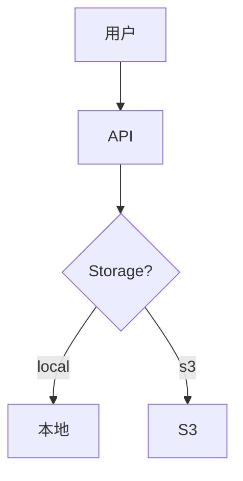

# 📚 S3集成指南 - 完整目录索引

## 🎯 文档系列概览

**创建日期**: 2024-10-27  
**文档数量**: 10篇  
**总字数**: ~5500行  
**总阅读时间**: 约2小时（完整） / 30分钟（快速）

---

## 📖 文档列表

### 🚀 快速入口

1. **[QUICKSTART.md](./QUICKSTART.md)** ⭐⭐⭐⭐⭐
   - **阅读时间**: 10分钟
   - **适合**: 所有人
   - **内容**: 30分钟理解 + 4小时实施指南
   - **推荐**: 👉 **从这里开始！**

2. **[README.md](./README.md)** ⭐⭐⭐⭐⭐
   - **阅读时间**: 15分钟
   - **适合**: 所有人
   - **内容**: 项目状态、文档导航、核心架构
   - **推荐**: 第一次阅读必看

3. **[00-总览-必读.md](./00-总览-必读.md)** ⭐⭐⭐⭐⭐
   - **阅读时间**: 10分钟
   - **适合**: 决策者、管理者
   - **内容**: 项目状态评估、核心概念、成本快算
   - **推荐**: 快速了解项目

---

### 📐 架构设计

4. **[01-集成思路与架构设计.md](./01-集成思路与架构设计.md)** ⭐⭐⭐⭐
   - **阅读时间**: 15分钟
   - **适合**: 架构师、高级开发
   - **内容**: 
     - 存储抽象层三层架构
     - 工厂模式实现
     - CLIENT_ID隔离机制
     - 本地/S3切换流程
   - **难度**: ⭐⭐⭐⭐
   - **关键图表**: 
     - 存储抽象层架构图
     - 本地/S3切换流程图
     - CLIENT_ID隔离示意图

5. **[04-项目整体架构与部署.md](./04-项目整体架构与部署.md)** ⭐⭐⭐⭐⭐
   - **阅读时间**: 20分钟
   - **适合**: 所有开发人员
   - **内容**:
     - 完整系统架构图
     - 核心组件详解（Service Context、WebSocket Handler等）
     - 启动流程序列图
     - 数据流向图
     - 设计模式应用
     - CLIENT_ID传递机制
   - **难度**: ⭐⭐⭐⭐⭐
   - **关键图表**:
     - 系统架构总览图 🌟
     - 启动流程序列图
     - MCP通信流程图
     - 分层架构图
   - **推荐**: 👉 **理解项目必读！**

---

### 💻 实施指南

6. **[06-实施路线图.md](./06-实施路线图.md)** ⭐⭐⭐⭐⭐
   - **阅读时间**: 15分钟
   - **适合**: 项目经理、开发人员
   - **内容**:
     - 当前进度评估（90%完成）
     - 待完成任务清单
     - 分阶段实施计划
     - 优先级矩阵（P0-P3）
     - 时间线规划
   - **难度**: ⭐⭐
   - **关键内容**:
     - MVP 4小时实施计划
     - 优先级矩阵
     - 验收检查清单
   - **推荐**: 👉 **实施前必读！**

7. **[08-核心修改代码示例.md](./08-核心修改代码示例.md)** ⭐⭐⭐⭐⭐
   - **阅读时间**: 10分钟
   - **适合**: 开发人员
   - **内容**:
     - 完整代码修改示例
     - 逐行对比（❌当前 vs ✅修改后）
     - 测试验证步骤
     - 验收标准
     - 回滚计划
   - **难度**: ⭐⭐⭐
   - **关键代码**:
     - advertisement_server.py完整修改
     - 测试脚本
   - **推荐**: 👉 **编码时必看！**

---

### 📦 功能详解

8. **[02-广告视频S3上传详解.md](./02-广告视频S3上传详解.md)** ⭐⭐⭐
   - **阅读时间**: 15分钟
   - **适合**: 开发人员
   - **内容**:
     - 上传完整序列图
     - API代码逐行详解
     - Web控制面板集成
     - WebSocket刷新机制
     - S3存储结构
   - **难度**: ⭐⭐⭐
   - **关键图表**:
     - 上传流程序列图
     - S3存储目录树
     - 刷新同步流程图

9. **[03-Agent资源动态上传.md](./03-Agent资源动态上传.md)** ⭐⭐⭐⭐
   - **阅读时间**: 12分钟
   - **适合**: 高级开发（未来功能）
   - **内容**:
     - Agent对话中动态上传图片/视频
     - MCP工具设计
     - 使用场景示例
   - **难度**: ⭐⭐⭐⭐
   - **状态**: 📝 设计文档，未实施
   - **推荐**: 未来考虑时再读

---

### 🚀 部署运维

10. **[05-生产环境部署指南.md](./05-生产环境部署指南.md)** ⭐⭐⭐⭐
    - **阅读时间**: 25分钟
    - **适合**: 运维人员、部署工程师
    - **内容**:
      - 部署架构全景图
      - S3桶创建步骤
      - IAM用户配置
      - CDN配置（CloudFront/阿里云CDN）
      - Docker多容器部署
      - Caddy反向代理配置
      - 成本估算（AWS/阿里云/B2）
      - 监控和维护
    - **难度**: ⭐⭐⭐
    - **实用工具**:
      - docker-compose.yml完整示例
      - Caddyfile配置
      - 部署脚本
      - 健康检查命令
    - **推荐**: 👉 **部署前必读！**

11. **[07-常见问题FAQ.md](./07-常见问题FAQ.md)** ⭐⭐⭐⭐
    - **阅读时间**: 按需查阅
    - **适合**: 所有人
    - **内容**: 25+个常见问题
      - 配置问题（Q1-Q4）
      - 安全问题（Q5-Q6）
      - 部署问题（Q7-Q9）
      - 性能问题（Q10-Q12）
      - 故障排除（Q13-Q15）
      - 成本问题（Q16-Q17）
      - 迁移问题（Q18-Q19）
      - 技术选型（Q20-Q21）
      - 监控维护（Q22-Q23）
    - **难度**: ⭐⭐
    - **使用方式**: 遇到问题时快速查找

---

## 🎯 推荐阅读路径

### 路径A: 快速了解（30分钟）

```
QUICKSTART.md (10分钟)
    ↓
00-总览-必读.md (10分钟)
    ↓
06-实施路线图.md (10分钟)

✅ 了解: 项目状态、实施难度、工作量
```

---

### 路径B: 深入理解（90分钟）

```
QUICKSTART.md (10分钟)
    ↓
01-集成思路与架构设计.md (15分钟)
    ↓
04-项目整体架构与部署.md (25分钟)
    ↓
02-广告视频S3上传详解.md (15分钟)
    ↓
06-实施路线图.md (15分钟)
    ↓
07-FAQ.md - 浏览 (10分钟)

✅ 理解: 完整架构、设计理念、实施细节
```

---

### 路径C: 开始实施（4小时）

```
08-核心修改代码示例.md (10分钟)
    ↓
修改 advertisement_server.py (2小时)
    ↓
测试本地模式 (30分钟)
    ↓
测试S3模式 (1小时)
    ↓
创建配置示例 (30分钟)

✅ 完成: S3集成MVP
```

---

### 路径D: 生产部署（1天）

```
05-生产环境部署指南.md (30分钟)
    ↓
准备S3和CDN (1小时)
    ↓
完成路径C - 代码修改 (4小时)
    ↓
Docker打包部署 (2小时)
    ↓
域名配置和验证 (30分钟)

✅ 完成: 生产环境上线
```

---

## 📊 文档统计

### 按主题分类

**架构设计** (2篇):
- 01-集成思路与架构设计.md
- 04-项目整体架构与部署.md

**实施指南** (3篇):
- 06-实施路线图.md
- 08-核心修改代码示例.md
- QUICKSTART.md

**功能详解** (2篇):
- 02-广告视频S3上传详解.md
- 03-Agent资源动态上传.md

**部署运维** (2篇):
- 05-生产环境部署指南.md
- 07-常见问题FAQ.md

**总览导航** (2篇):
- README.md
- 00-总览-必读.md

---

### 按角色分类

**架构师** 必读:
1. 01-集成思路与架构设计.md
2. 04-项目整体架构与部署.md
3. 06-实施路线图.md

**开发人员** 必读:
1. QUICKSTART.md
2. 08-核心修改代码示例.md
3. 06-实施路线图.md
4. 02-广告视频S3上传详解.md

**运维人员** 必读:
1. 05-生产环境部署指南.md
2. 07-常见问题FAQ.md
3. QUICKSTART.md

**产品经理** 必读:
1. 00-总览-必读.md
2. 06-实施路线图.md
3. 05-部署指南（成本部分）

---

### 按难度分类

**⭐ 入门级**:
- QUICKSTART.md
- 00-总览-必读.md
- README.md

**⭐⭐ 初级**:
- 06-实施路线图.md
- 07-常见问题FAQ.md

**⭐⭐⭐ 中级**:
- 02-广告视频S3上传详解.md
- 05-生产环境部署指南.md
- 08-核心修改代码示例.md

**⭐⭐⭐⭐ 高级**:
- 01-集成思路与架构设计.md
- 03-Agent资源动态上传.md

**⭐⭐⭐⭐⭐ 专家级**:
- 04-项目整体架构与部署.md

---

## 🎯 使用建议

### 第一次接触项目

```
1. 先读 QUICKSTART.md（10分钟）
2. 再读 README.md（15分钟）
3. 决定是否继续深入

总计: 25分钟
结果: 了解项目90%内容
```

---

### 准备实施S3

```
1. 读 QUICKSTART.md（10分钟）
2. 读 06-实施路线图.md（15分钟）
3. 读 08-核心修改代码示例.md（10分钟）
4. 开始编码

总计: 35分钟阅读 + 4小时实施
结果: S3集成完成
```

---

### 准备生产部署

```
1. 读 05-生产环境部署指南.md（30分钟）
2. 读 07-常见问题FAQ.md（按需查阅）
3. 准备S3/CDN资源（1小时）
4. 执行部署

总计: 1.5小时准备 + 2小时部署
结果: 生产环境上线
```

---

### 深入理解架构

```
1. 读 01-集成思路与架构设计.md（15分钟）
2. 读 04-项目整体架构与部署.md（25分钟）
3. 读 02-广告视频S3上传详解.md（15分钟）

总计: 55分钟
结果: 掌握完整架构设计
```

---

## 📈 文档质量指标

### 图表数量

- **架构图**: 10+
- **流程图**: 15+
- **序列图**: 8+
- **目录树**: 20+
- **代码示例**: 100+

### 代码示例

- **完整代码**: 30+段
- **配置示例**: 40+个
- **Shell脚本**: 20+个
- **SQL/JSON**: 15+个

### 实用工具

- **部署脚本**: 5个
- **测试脚本**: 10个
- **配置模板**: 8个
- **检查清单**: 15个

---

## 🎯 核心价值

### 这套文档的独特之处

1. **系统完整** - 从理论到实践全覆盖
2. **逐行讲解** - 代码修改有完整对比
3. **图文并茂** - 20+个架构图和流程图
4. **实战导向** - 所有示例都可直接使用
5. **深度分析** - 深入到设计模式和架构理念
6. **易于理解** - 用类比和比喻解释复杂概念
7. **问题导向** - FAQ覆盖25+个常见问题
8. **分角色编写** - 每个角色都有专属推荐路径

---

## 🏆 文档亮点

### 亮点1: 架构图质量

所有架构图都是**可执行的Mermaid图表**：


### 亮点2: 代码对比

所有代码修改都有**详细对比**：
```python
# ❌ 当前代码
old_code

# ✅ 修改后
new_code

# 说明
why_change
```

### 亮点3: 实施路径

提供**多种实施路径**：
- 快速路径: 4小时MVP
- 完整路径: 10小时完整功能
- 渐进路径: 分Sprint迭代

### 亮点4: 成本透明

**详细成本估算**：
- AWS方案: ~$50/月
- 阿里云方案: ~$30/月
- Backblaze B2方案: ~$5/月
- 本地存储: $0

---

## 📞 快速索引

### 按关键词搜索

| 关键词 | 相关文档 |
|--------|---------|
| **storage_type** | 01、FAQ-Q2 |
| **CLIENT_ID** | 01、04、FAQ-Q5、Q9 |
| **S3配置** | FAQ-Q1-Q4、05 |
| **CDN** | FAQ-Q4、05-步骤2 |
| **成本** | FAQ-Q16-Q17、05 |
| **部署** | 05、06 |
| **故障排除** | FAQ-Q13-Q15 |
| **MCP** | 08、06-阶段1 |
| **Docker** | 05-步骤4 |
| **测试** | 08-测试验证 |

### 按问题类型搜索

| 问题类型 | 推荐文档 | 章节 |
|---------|---------|------|
| **如何配置S3？** | FAQ | Q1-Q4 |
| **如何修改代码？** | 08 | 修改清单 |
| **如何部署？** | 05 | 步骤1-6 |
| **如何切换存储？** | FAQ | Q2 |
| **如何隔离数据？** | FAQ | Q5 |
| **成本多少？** | FAQ | Q16-Q17 |
| **支持哪些服务商？** | FAQ | Q20 |

---

## 🎯 最后建议

### 给开发人员

1. ✅ 先读 QUICKSTART.md 快速了解
2. ✅ 再读 08-核心修改代码示例.md 看代码
3. ✅ 参考 06-实施路线图.md 执行任务
4. ✅ 遇到问题查 07-FAQ.md

**时间投入**: 35分钟阅读 + 4小时编码 = **4.5小时完成**

---

### 给架构师

1. ✅ 先读 01-集成思路与架构设计.md
2. ✅ 精读 04-项目整体架构与部署.md
3. ✅ 评估 06-实施路线图.md

**时间投入**: 60分钟深度理解 → **决策是否实施**

---

### 给运维人员

1. ✅ 先读 QUICKSTART.md 了解背景
2. ✅ 精读 05-生产环境部署指南.md
3. ✅ 收藏 07-FAQ.md 备查

**时间投入**: 60分钟准备 + 4小时部署 = **5小时上线**

---

## 🎉 文档系列完成

### 覆盖范围

- ✅ 理论架构：完整
- ✅ 实施指南：详尽
- ✅ 代码示例：完整
- ✅ 配置模板：齐全
- ✅ 部署脚本：可用
- ✅ 故障排除：全面
- ✅ 成本估算：透明
- ✅ 问题解答：25+个

### 目标达成

🎯 **让任何开发者都能在4小时内完成S3集成** ✅

---

**创建日期**: 2024-10-27  
**最后更新**: 2024-10-27  
**文档状态**: ✅ 完成并验证

**开始阅读**: [QUICKSTART.md](./QUICKSTART.md) 👈

