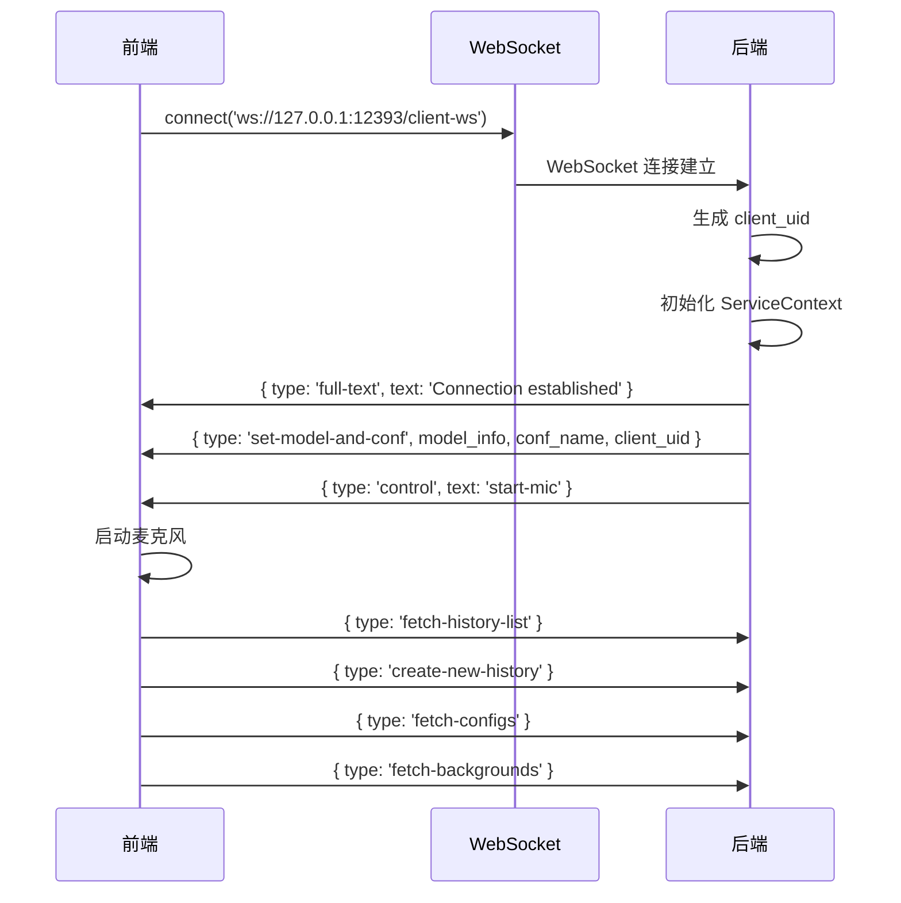
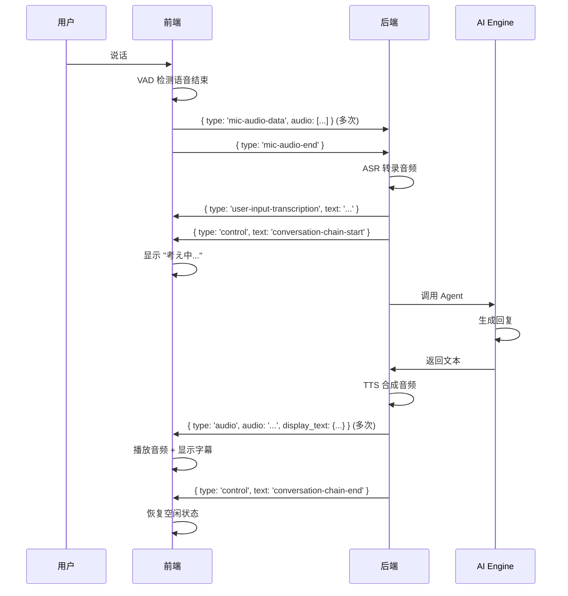
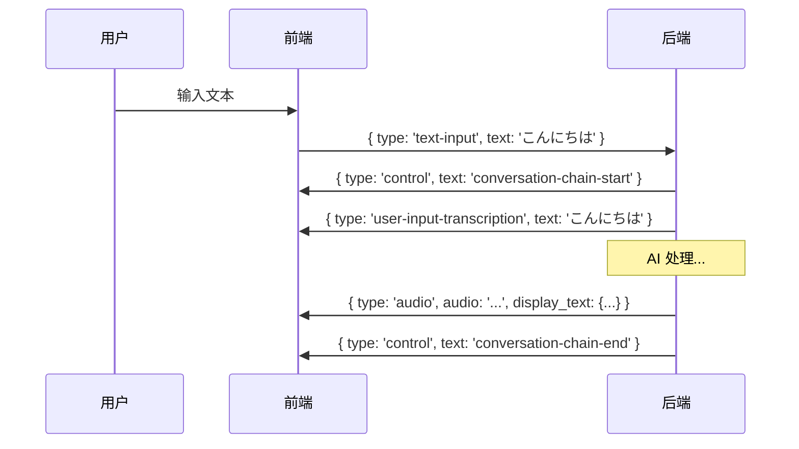
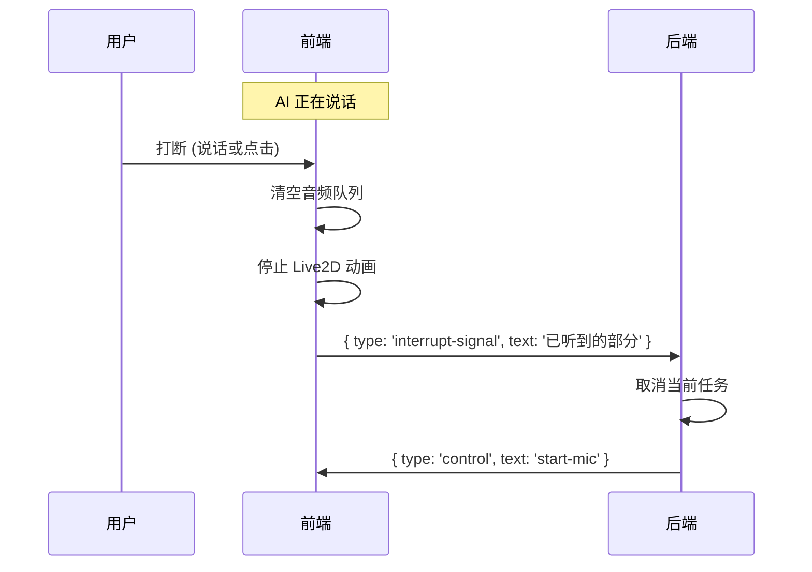
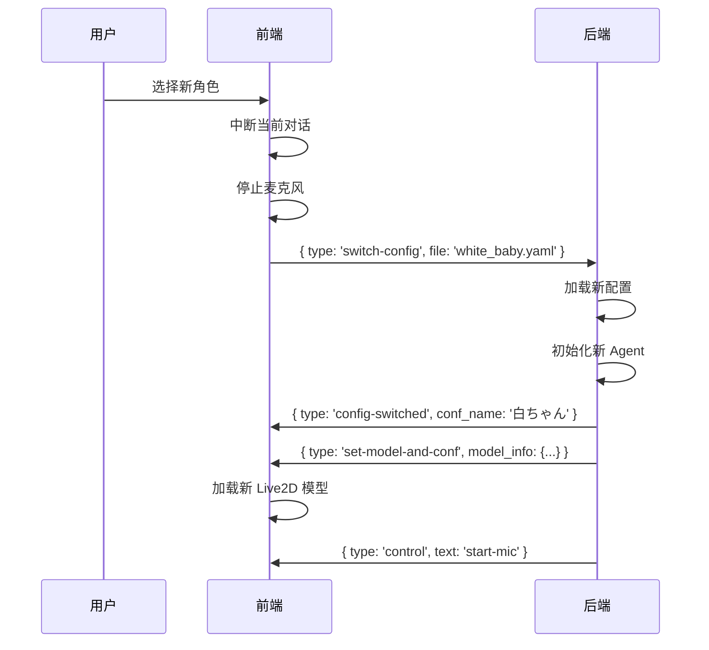

# 前后端架构与 WebSocket 通信指南

## 📋 目录

1. [项目整体架构](#1-项目整体架构)
2. [前后端分离实现](#2-前后端分离实现)
3. [WebSocket 通信机制](#3-websocket-通信机制)
4. [消息类型详解](#4-消息类型详解)
5. [REST API 端点](#5-rest-api-端点)
6. [完整通信流程](#6-完整通信流程)
7. [代码调用链路](#7-代码调用链路)

---

## 1. 项目整体架构

### 1.1 技术栈

```
┌─────────────────────────────────────────────────────────────┐
│                         前端 (Frontend)                       │
│  ┌────────────────────────────────────────────────────────┐ │
│  │ Electron + React + TypeScript                          │ │
│  │ • 框架: Electron (桌面应用)                              │ │
│  │ • UI: React 18 + Chakra UI                             │ │
│  │ • 状态管理: Zustand + Context API                       │ │
│  │ • 构建工具: Vite + electron-vite                        │ │
│  │ • 实时通信: WebSocket (RxJS Subject)                    │ │
│  └────────────────────────────────────────────────────────┘ │
└─────────────────────────────────────────────────────────────┘
                              ↕ 
                    WebSocket + REST API
                              ↕
┌─────────────────────────────────────────────────────────────┐
│                         后端 (Backend)                        │
│  ┌────────────────────────────────────────────────────────┐ │
│  │ Python + FastAPI                                       │ │
│  │ • Web框架: FastAPI (异步高性能)                         │ │
│  │ • AI引擎: LangChain + 自定义Agent                       │ │
│  │ • 语音识别: Sherpa-ONNX / OpenAI Whisper               │ │
│  │ • 语音合成: Fish Audio TTS                              │ │
│  │ • WebSocket: FastAPI WebSocket                         │ │
│  └────────────────────────────────────────────────────────┘ │
└─────────────────────────────────────────────────────────────┘
```

### 1.2 架构设计原则

```
前端职责:
├── UI 渲染和用户交互
├── 音频采集和播放
├── Live2D 模型渲染和动画
├── 本地状态管理
└── WebSocket 连接管理

后端职责:
├── AI 对话引擎 (LangChain)
├── 语音识别 (ASR)
├── 语音合成 (TTS)
├── 对话历史管理
├── 多客户端会话管理
└── MCP 工具调用
```

---

## 2. 前后端分离实现

### 2.1 服务器配置

**默认地址配置**

```typescript
// frontend/src/renderer/src/utils/env-config.ts
export function getServerConfig() {
  return {
    baseUrl: 'http://127.0.0.1:12393',
    wsUrl: 'ws://127.0.0.1:12393/client-ws'
  };
}
```

**后端服务启动**

```python
# run_server.py
import uvicorn
from src.ai_chat.server import app

if __name__ == "__main__":
    uvicorn.run(
        app,
        host="0.0.0.0",
        port=12393,
        log_level="info"
    )
```

### 2.2 跨域处理

```python
# src/ai_chat/server.py
from fastapi.middleware.cors import CORSMiddleware

app.add_middleware(
    CORSMiddleware,
    allow_origins=["*"],  # Electron 本地应用允许所有来源
    allow_credentials=True,
    allow_methods=["*"],
    allow_headers=["*"],
)
```

### 2.3 静态资源服务

```python
# 后端提供静态资源访问
app.mount("/live2d-models", StaticFiles(directory="live2d-models"))
app.mount("/ads", StaticFiles(directory="ads"))
app.mount("/videos", StaticFiles(directory="videos"))
app.mount("/backgrounds", StaticFiles(directory="backgrounds"))
```

前端通过 `baseUrl` 访问这些资源：
```typescript
const modelUrl = `${baseUrl}/live2d-models/sakura/sakura.model3.json`;
const adUrl = `${baseUrl}/ads/advertisement.mp4`;
```

---

## 3. WebSocket 通信机制

### 3.1 前端 WebSocket 服务

**核心服务类** - `frontend/src/renderer/src/services/websocket-service.tsx`

```typescript
class WebSocketService {
  private ws: WebSocket | null = null;
  private messageSubject = new Subject<MessageEvent>();  // 消息发布订阅
  private stateSubject = new Subject<'CONNECTING' | 'OPEN' | 'CLOSING' | 'CLOSED'>();
  
  // 单例模式
  static getInstance() {
    if (!WebSocketService.instance) {
      WebSocketService.instance = new WebSocketService();
    }
    return WebSocketService.instance;
  }

  // 连接管理
  connect(url: string) {
    this.ws = new WebSocket(url);
    
    this.ws.onopen = () => {
      this.startHeartbeat();  // 心跳保活
      this.initializeConnection();  // 初始化
    };
    
    this.ws.onmessage = (event) => {
      const message = JSON.parse(event.data);
      this.messageSubject.next(message);  // 发布消息
    };
    
    this.ws.onclose = () => {
      this.scheduleReconnect();  // 自动重连
    };
  }

  // 发送消息
  sendMessage(message: any) {
    if (this.ws?.readyState === WebSocket.OPEN) {
      this.ws.send(JSON.stringify(message));
    } else {
      this.outbox.push(message);  // 连接断开时排队
    }
  }

  // 订阅消息
  onMessage(callback: (message: MessageEvent) => void) {
    return this.messageSubject.subscribe(callback);
  }
}

export const wsService = WebSocketService.getInstance();
```

**核心特性：**
- ✅ **单例模式** - 全局唯一连接
- ✅ **心跳机制** - 每 10 秒发送心跳，90 秒无响应视为断线
- ✅ **自动重连** - 断线后指数退避重连（1s → 2s → 4s → 最大15s）
- ✅ **消息队列** - 断线时消息排队，重连后自动发送
- ✅ **订阅模式** - 使用 RxJS Subject 实现发布订阅

### 3.2 前端消息处理器

**消息分发** - `frontend/src/renderer/src/services/websocket-handler.tsx`

```typescript
const WebSocketHandler = memo(({ children }) => {
  useEffect(() => {
    // 订阅 WebSocket 消息
    const messageSubscription = wsService.onMessage(handleWebSocketMessage);
    
    return () => {
      // 组件卸载时取消订阅，防止内存泄漏
      messageSubscription.unsubscribe();
    };
  }, [handleWebSocketMessage]);

  const handleWebSocketMessage = useCallback((message: MessageEvent) => {
    switch (message.type) {
      case 'audio':
        // 处理 TTS 音频
        addAudioTask({
          audioBase64: message.audio,
          volumes: message.volumes,
          displayText: message.display_text,
          expressions: message.actions?.expressions
        });
        break;
      
      case 'full-text':
        // 更新字幕
        setSubtitleText(message.text);
        break;
      
      case 'control':
        // 处理控制指令
        handleControlMessage(message.text);
        break;
      
      case 'set-model-and-conf':
        // 设置 Live2D 模型
        setModelInfo(message.model_info);
        setConfName(message.conf_name);
        break;
      
      // ... 更多消息类型
    }
  }, []);

  return (
    <WebSocketContext.Provider value={webSocketContextValue}>
      {children}
    </WebSocketContext.Provider>
  );
});
```

### 3.3 后端 WebSocket 处理器

**连接管理** - `src/ai_chat/websocket_handler.py`

```python
class WebSocketHandler:
    def __init__(self, default_context_cache: ServiceContext):
        self.client_connections: Dict[str, WebSocket] = {}  # 客户端连接
        self.client_contexts: Dict[str, ServiceContext] = {}  # 客户端上下文
        self.current_conversation_tasks: Dict[str, asyncio.Task] = {}  # 对话任务
        self._message_handlers = self._init_message_handlers()  # 消息处理器映射

    async def handle_new_connection(self, websocket: WebSocket, client_uid: str):
        """处理新连接"""
        # 1. 初始化服务上下文
        session_context = await self._init_service_context(websocket.send_text, client_uid)
        
        # 2. 存储连接和上下文
        self.client_connections[client_uid] = websocket
        self.client_contexts[client_uid] = session_context
        
        # 3. 发送初始化消息
        await websocket.send_text(json.dumps({
            "type": "set-model-and-conf",
            "model_info": session_context.live2d_model.model_info,
            "conf_name": session_context.character_config.conf_name,
            "client_uid": client_uid
        }))
        
        # 4. 启动麦克风
        await websocket.send_text(json.dumps({"type": "control", "text": "start-mic"}))

    async def handle_websocket_communication(self, websocket: WebSocket, client_uid: str):
        """处理持续通信"""
        try:
            while True:
                data = await websocket.receive_json()
                await self._route_message(websocket, client_uid, data)
        except WebSocketDisconnect:
            await self.handle_disconnect(client_uid)

    async def _route_message(self, websocket: WebSocket, client_uid: str, data: dict):
        """路由消息到对应的处理器"""
        msg_type = data.get("type")
        handler = self._message_handlers.get(msg_type)
        if handler:
            await handler(websocket, client_uid, data)
```

**消息处理器映射**

```python
def _init_message_handlers(self) -> Dict[str, Callable]:
    return {
        # 历史记录管理
        "fetch-history-list": self._handle_history_list_request,
        "fetch-and-set-history": self._handle_fetch_history,
        "create-new-history": self._handle_create_history,
        "delete-history": self._handle_delete_history,
        
        # 对话相关
        "mic-audio-data": self._handle_audio_data,
        "mic-audio-end": self._handle_conversation_trigger,
        "text-input": self._handle_conversation_trigger,
        "ai-speak-signal": self._handle_conversation_trigger,
        "interrupt-signal": self._handle_interrupt,
        
        # 配置管理
        "fetch-configs": self._handle_fetch_configs,
        "switch-config": self._handle_config_switch,
        "fetch-backgrounds": self._handle_fetch_backgrounds,
        
        # 工具调用
        "mcp-tool-call": self._handle_mcp_tool_call,
        
        # 心跳
        "heartbeat": self._handle_heartbeat,
    }
```

### 3.4 路由注册

**FastAPI 路由** - `src/ai_chat/routes.py`

```python
def init_client_ws_route(default_context_cache: ServiceContext) -> APIRouter:
    router = APIRouter()
    ws_handler = WebSocketHandler(default_context_cache)

    @router.websocket("/client-ws")
    async def websocket_endpoint(websocket: WebSocket):
        await websocket.accept()
        client_uid = str(uuid4())
        
        try:
            await ws_handler.handle_new_connection(websocket, client_uid)
            await ws_handler.handle_websocket_communication(websocket, client_uid)
        except WebSocketDisconnect:
            await ws_handler.handle_disconnect(client_uid)

    return router
```

---

## 4. 消息类型详解

### 4.1 前端 → 后端消息

#### 音频输入

```typescript
// 1. 发送音频数据块
{
  type: "mic-audio-data",
  audio: [0.1, 0.2, 0.3, ...]  // Float32Array
}

// 2. 发送音频结束信号（触发 ASR）
{
  type: "mic-audio-end"
}
```

**调用位置**: `frontend/src/renderer/src/hooks/utils/use-send-audio.tsx`

#### 文本输入

```typescript
{
  type: "text-input",
  text: "こんにちは"
}
```

**调用位置**: 聊天输入框、控制面板

#### 中断对话

```typescript
{
  type: "interrupt-signal",
  text: "已听到的部分回复"
}
```

**调用位置**: `frontend/src/renderer/src/hooks/utils/use-interrupt.ts`

#### 历史记录管理

```typescript
// 获取历史列表
{ type: "fetch-history-list" }

// 创建新历史
{ type: "create-new-history" }

// 加载指定历史
{
  type: "fetch-and-set-history",
  history_uid: "uuid-string"
}

// 删除历史
{
  type: "delete-history",
  history_uid: "uuid-string"
}
```

**调用位置**: `frontend/src/renderer/src/hooks/sidebar/use-history-drawer.ts`

#### 配置切换

```typescript
// 获取配置列表
{ type: "fetch-configs" }

// 切换角色
{
  type: "switch-config",
  file: "sakura.yaml"
}

// 获取背景列表
{ type: "fetch-backgrounds" }
```

**调用位置**: `frontend/src/renderer/src/hooks/utils/use-switch-character.tsx`

#### AI 主动发言

```typescript
{
  type: "ai-speak-signal",
  idle_time: 5000  // 毫秒
}
```

**调用位置**: `frontend/src/renderer/src/hooks/utils/use-trigger-speak.ts`

#### MCP 工具调用

```typescript
{
  type: "mcp-tool-call",
  tool_name: "get_weather",
  arguments: {
    city: "Tokyo"
  }
}
```

#### 心跳

```typescript
{ type: "heartbeat" }
```

**频率**: 每 10 秒发送一次

### 4.2 后端 → 前端消息

#### 音频响应 (TTS)

```typescript
{
  type: "audio",
  audio: "base64-encoded-audio-data",
  volumes: [0.5, 0.8, 0.6, ...],  // 音量包络
  slice_length: 100,  // 切片长度
  display_text: {
    text: "こんにちは！",
    name: "さくら",
    avatar: "/avatars/sakura.png"
  },
  actions: {
    expressions: [3, 5],  // Live2D 表情索引
    pictures: [],
    sounds: []
  },
  forwarded: false  // 是否是转发的消息
}
```

**处理位置**: `websocket-handler.tsx` → `addAudioTask()` → 音频队列播放

#### 字幕/文本显示

```typescript
{
  type: "full-text",
  text: "こんにちは！元気ですか？"
}
```

**处理位置**: 更新字幕显示

#### 控制指令

```typescript
{
  type: "control",
  text: "start-mic" | "stop-mic" | "conversation-chain-start" | "conversation-chain-end"
}
```

**控制流程**:
- `conversation-chain-start`: AI 开始思考
- `conversation-chain-end`: AI 回复完成

#### 模型配置

```typescript
{
  type: "set-model-and-conf",
  model_info: {
    url: "http://127.0.0.1:12393/live2d-models/sakura/sakura.model3.json",
    scale: 0.12,
    x: 0,
    y: 200
  },
  conf_name: "さくら",
  conf_uid: "sakura-uuid",
  client_uid: "client-uuid"
}
```

**处理位置**: 初始化 Live2D 模型

#### 配置列表

```typescript
{
  type: "config-files",
  configs: [
    { name: "さくら", filename: "sakura.yaml" },
    { name: "白ちゃん", filename: "white_baby.yaml" }
  ]
}
```

#### 配置切换完成

```typescript
{
  type: "config-switched",
  conf_name: "さくら"
}
```

#### 历史记录数据

```typescript
{
  type: "history-data",
  messages: [
    {
      id: "msg-1",
      role: "human",
      content: "こんにちは",
      timestamp: "2025-10-05T12:00:00Z"
    },
    {
      id: "msg-2",
      role: "ai",
      content: "こんにちは！",
      timestamp: "2025-10-05T12:00:01Z"
    }
  ]
}
```

#### 历史记录列表

```typescript
{
  type: "history-list",
  histories: [
    {
      uid: "history-1",
      latest_message: {
        role: "ai",
        content: "またね！",
        timestamp: "2025-10-05T12:10:00Z"
      },
      timestamp: "2025-10-05T12:00:00Z"
    }
  ]
}
```

#### 用户输入转录

```typescript
{
  type: "user-input-transcription",
  text: "こんにちは"  // ASR 识别结果
}
```

#### 洗衣机视频响应

```typescript
{
  type: "laundry-video-response",
  video_path: "/videos/machine_1.mp4",
  machine_id: "1",
  video_name: "1号洗濯機の使用説明"
}
```

#### 唤醒词状态

```typescript
{
  type: "wake-word-state",
  action: "wake_up" | "sleep" | "ignored",
  matched_word: "さくら",
  language: "ja",
  current_state: "active",
  advertisement_control: {
    should_show_ads: false,
    control_action: "stop_ads",
    trigger_reason: "wake_word_detected"
  }
}
```

#### 错误消息

```typescript
{
  type: "error",
  message: "Failed to process request"
}
```

#### 心跳响应

```typescript
{
  type: "heartbeat-ack"
}
```

---

## 5. REST API 端点

### 5.1 语音识别

```http
POST /asr
Content-Type: multipart/form-data

file: audio.wav (16kHz, mono, PCM16)
```

**响应**:
```json
{
  "text": "こんにちは"
}
```

**调用场景**: Web 工具独立调用

### 5.2 广告视频管理

```http
# 获取广告列表
GET /api/ads
Response: {
  "advertisements": [
    {
      "id": "ad_001",
      "name": "advertisement",
      "filename": "ad.mp4",
      "url_path": "/ads/ad.mp4",
      "size_mb": 50.2,
      "format": ".mp4"
    }
  ],
  "total_count": 1
}

# 上传广告
POST /api/ads/upload
Content-Type: multipart/form-data
file: video.mp4

# 删除广告
DELETE /api/ads/{filename}
```

**调用位置**: `frontend/src/renderer/src/components/sidebar/setting/media.tsx`

### 5.3 洗衣机视频管理

```http
# 获取视频列表
GET /api/videos

# 上传视频
POST /api/videos/upload

# 删除视频
DELETE /api/videos/{filename}
```

### 5.4 Live2D 模型信息

```http
GET /live2d-models/info
Response: {
  "type": "live2d-models/info",
  "count": 3,
  "characters": [
    {
      "name": "sakura",
      "avatar": "live2d-models/sakura/sakura.png",
      "model_path": "live2d-models/sakura/sakura.model3.json"
    }
  ]
}
```

---

## 6. 完整通信流程

### 6.1 初始化流程



### 6.2 语音对话流程



### 6.3 文本输入流程



### 6.4 中断流程



### 6.5 角色切换流程



---

## 7. 代码调用链路

### 7.1 发送消息的代码路径

```
用户操作
  ↓
UI 组件 (如 ChatInput)
  ↓
Custom Hook (如 useSendAudio)
  ↓
useWebSocket().sendMessage()
  ↓
wsService.sendMessage()
  ↓
WebSocket.send(JSON.stringify(message))
  ↓
网络传输
  ↓
后端 FastAPI WebSocket
  ↓
websocket_handler.py - handle_websocket_communication()
  ↓
websocket_handler.py - _route_message()
  ↓
对应的消息处理器 (如 _handle_audio_data)
  ↓
业务逻辑处理
```

### 7.2 接收消息的代码路径

```
后端发送消息
  ↓
websocket.send_text(json.dumps(message))
  ↓
网络传输
  ↓
前端 WebSocket.onmessage
  ↓
wsService - messageSubject.next(message)
  ↓
所有订阅者收到消息
  ↓
websocket-handler.tsx - handleWebSocketMessage()
  ↓
根据 message.type 分发
  ↓
更新状态 / 调用函数 / 播放音频
  ↓
UI 更新
```

### 7.3 关键文件映射

| 功能 | 前端文件 | 后端文件 |
|------|---------|---------|
| WebSocket 服务 | `services/websocket-service.tsx` | `websocket_handler.py` |
| 消息处理 | `services/websocket-handler.tsx` | `websocket_handler.py` |
| 音频发送 | `hooks/utils/use-send-audio.tsx` | `_handle_audio_data()` |
| 文本输入 | 聊天输入框组件 | `_handle_conversation_trigger()` |
| 中断功能 | `hooks/utils/use-interrupt.ts` | `_handle_interrupt()` |
| 历史管理 | `hooks/sidebar/use-history-drawer.ts` | `_handle_history_*()` |
| 角色切换 | `hooks/utils/use-switch-character.tsx` | `_handle_config_switch()` |
| 对话处理 | - | `conversations/conversation_handler.py` |
| 路由注册 | - | `routes.py` |

---

## 8. 最佳实践和注意事项

### 8.1 WebSocket 连接管理

✅ **正确做法**:
```typescript
useEffect(() => {
  const messageSubscription = wsService.onMessage(handleMessage);
  
  return () => {
    // 组件卸载时一定要取消订阅
    messageSubscription.unsubscribe();
  };
}, [handleMessage]);
```

❌ **错误做法**:
```typescript
// 忘记取消订阅会导致内存泄漏
useEffect(() => {
  wsService.onMessage(handleMessage);
  // 缺少清理函数
}, []);
```

### 8.2 消息发送时机

✅ **正确做法**:
```typescript
const { sendMessage } = useWebSocket();

const handleSend = () => {
  // 检查连接状态
  if (wsState === 'OPEN') {
    sendMessage({ type: 'text-input', text: inputValue });
  } else {
    // wsService 会自动排队
    sendMessage({ type: 'text-input', text: inputValue });
  }
};
```

### 8.3 大文件传输

✅ **使用 REST API**:
```typescript
const formData = new FormData();
formData.append('file', videoFile);
await fetch(`${baseUrl}/api/ads/upload`, {
  method: 'POST',
  body: formData
});
```

❌ **不要用 WebSocket 传大文件**:
```typescript
// ❌ 会阻塞 WebSocket 连接
sendMessage({ type: 'upload', data: largeBase64String });
```

### 8.4 心跳和重连

- 心跳间隔: **10 秒**
- 超时判定: **90 秒**无响应
- 重连策略: 指数退避 (1s, 2s, 4s, 8s, 最大 15s)

### 8.5 错误处理

```typescript
wsService.onMessage((message) => {
  if (message.type === 'error') {
    toaster.create({
      title: 'エラー',
      description: message.message,
      type: 'error'
    });
  }
});
```

---

## 9. 调试技巧

### 9.1 查看 WebSocket 消息

**浏览器开发者工具**:
1. 打开 DevTools → Network 标签
2. 过滤 "WS" (WebSocket)
3. 点击连接查看消息详情

**代码中添加日志**:
```typescript
wsService.onMessage((message) => {
  console.log('📥 收到消息:', message);
});

// 发送消息时
console.log('📤 发送消息:', message);
wsService.sendMessage(message);
```

### 9.2 监控订阅数量

```typescript
// 开发环境监控
if (process.env.NODE_ENV === 'development') {
  setInterval(() => {
    const counts = wsService.getSubscriptionCount();
    console.debug('📊 订阅数量:', counts);
    if (counts.message > 2) {
      console.warn('⚠️ 检测到订阅泄漏！');
    }
  }, 30000);
}
```

### 9.3 后端日志

```python
from loguru import logger

logger.info(f"📥 收到消息: {msg_type} from {client_uid}")
logger.debug(f"📤 发送消息: {message}")
```

---

## 10. 总结

### 架构优势

1. **实时性** - WebSocket 提供零延迟的双向通信
2. **可扩展性** - 消息驱动架构，易于添加新功能
3. **可维护性** - 前后端职责清晰分离
4. **资源效率** - 持久连接减少握手开销

### 技术选型理由

- **WebSocket vs REST**: 实时对话需要双向通信，REST 轮询延迟高且低效
- **FastAPI vs Flask**: FastAPI 原生支持异步 WebSocket，性能更好
- **RxJS Subject vs EventEmitter**: 提供更强大的响应式编程能力
- **Zustand vs Redux**: 更轻量，减少样板代码

---

## 参考资源

- [FastAPI WebSocket 文档](https://fastapi.tiangolo.com/advanced/websockets/)
- [MDN WebSocket API](https://developer.mozilla.org/zh-CN/docs/Web/API/WebSocket)
- [RxJS Subject 文档](https://rxjs.dev/guide/subject)

---

**文档版本**: v1.0  
**最后更新**: 2025-10-05  
**维护者**: AI Assistant
